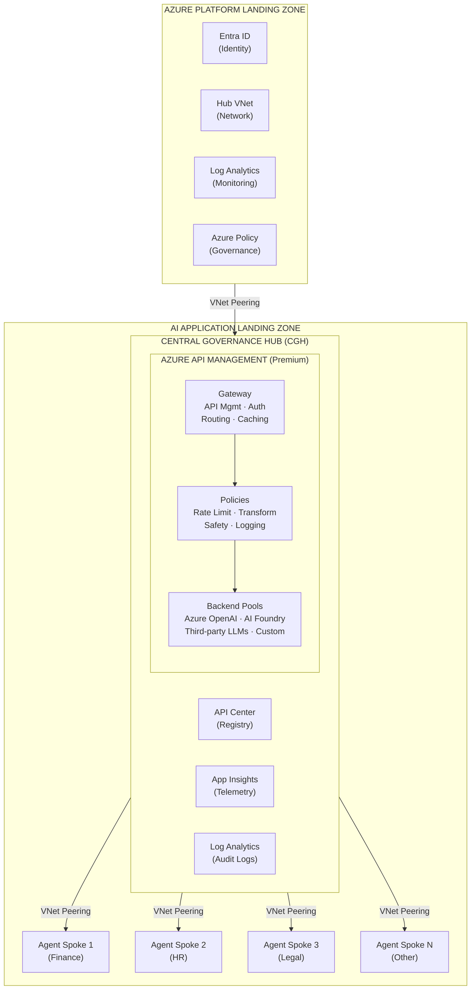
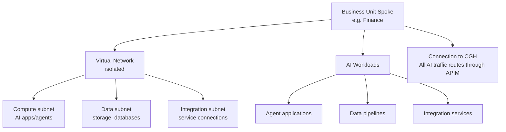
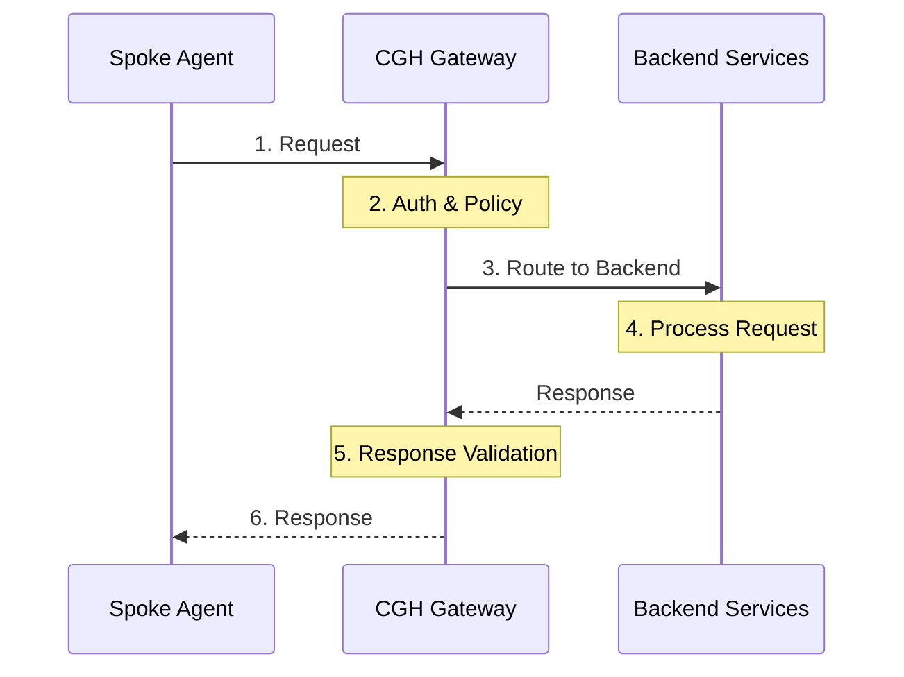
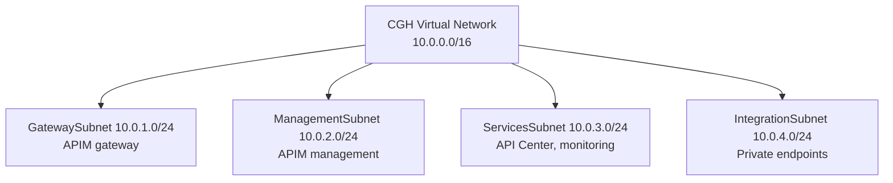
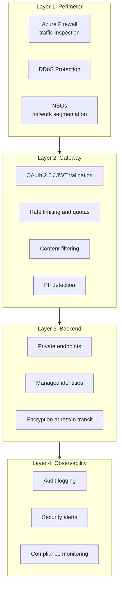
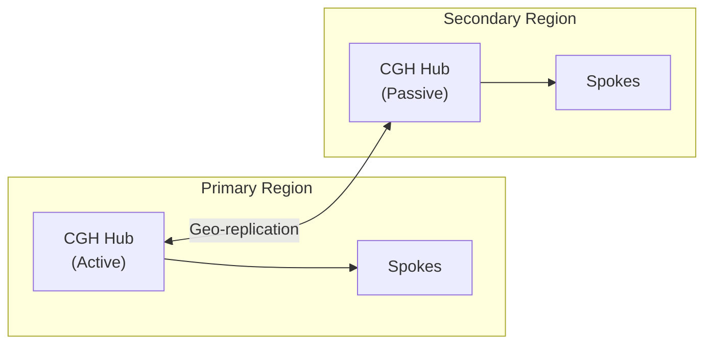

# APIM-Based AI Landing Zone

This reference architecture describes the **AI Landing Zone for APIM** pattern, which leverages Azure API Management as a central AI gateway for comprehensive governance, policy enforcement, and observability across AI workloads.

<Info>
This architecture implements the [hub-spoke networking model](/architecture/hub-spoke-overview) with APIM at the center of the hub, providing unified governance for all AI traffic across your organization.
</Info>

## Architecture Overview



## Hub Components

The Central Governance Hub (CGH) contains the core governance infrastructure:

### Azure API Management (Premium Tier)

The AI Gateway provides unified entry point for all AI traffic:

| Feature | Capability | Purpose |
|---------|-----------|---------|
| **Token Rate Limiting** | `rate-limit-by-key` with token counting | Prevent cost overruns, enforce quotas |
| **Semantic Caching** | Built-in caching policy | Reduce costs, improve latency |
| **LLM Routing** | Dynamic backend routing | Multi-model support, failover |
| **Load Balancing** | Weighted backend pools | High availability, performance |
| **Authentication** | OAuth 2.0, JWT validation | Secure access control |
| **Policy Framework** | XML-based policies | Custom governance rules |

### API Center

The Universal AI Registry provides:

- **Discovery**: Centralized catalog of AI services and models
- **Versioning**: Track API versions and changes
- **Governance**: Enforce standards across all AI APIs
- **Lifecycle**: Manage API deprecation and retirement

### Content Safety Integration

Integrated content filtering and safety:

```xml
<!-- Example: Content safety check policy -->
<send-request mode="new" response-variable-name="safetyCheck">
    <set-url>https://contentsafety.cognitive.microsoft.com/</set-url>
    <set-method>POST</set-method>
    <set-body>@{
        return new JObject(
            new JProperty("text", context.Request.Body.As<string>())
        ).ToString();
    }</set-body>
</send-request>
```

### Observability Stack

| Component | Purpose | Data Collected |
|-----------|---------|----------------|
| **Application Insights** | Performance monitoring | Request latency, error rates, dependencies |
| **Log Analytics** | Centralized logging | Audit trails, security events |
| **Azure Monitor** | Alerting and dashboards | Custom metrics, alerting rules |

## Spoke Architecture Patterns

Agent Environment Spokes (CAS) connect to the hub for governance while maintaining workload isolation:

### Business Unit Spokes

Each business unit deploys its own spoke:



### AI Workload Spokes

For specialized AI workloads:

- **Multi-Agent Spokes**: Complex agent orchestration scenarios
- **Data Science Spokes**: Model training and experimentation
- **Production Spokes**: High-availability production deployments

### Shared Services Spokes

Optional shared infrastructure:

- **Data Lake Spoke**: Centralized data storage for AI workloads
- **Model Registry Spoke**: Shared model management
- **Monitoring Spoke**: Aggregated observability data

## Network Topology

### Traffic Flow



### Private Connectivity

All connections use private networking:

| Connection | Method | Purpose |
|------------|--------|---------|
| Hub ↔ Spokes | VNet Peering | Secure spoke-to-hub connectivity |
| APIM → Backends | Private Endpoints | Private LLM access |
| Spoke → Hub | Gateway Transit | Route through hub firewall |
| Management | Private Link | Secure management plane |

### Subnet Design (Hub)



## Security Boundaries

### Defense in Depth



### Policy Enforcement

<Accordion title="Sample Token Rate Limiting Policy">
```xml
<policies>
    <inbound>
        <base />
        <!-- Extract team ID from JWT -->
        <set-variable name="teamId" value="@(context.Request.Headers.GetValueOrDefault("Authorization", "").Split(' ')[1])" />
        
        <!-- Token-based rate limiting per team -->
        <rate-limit-by-key calls="1000"
                          renewal-period="60"
                          counter-key="@((string)context.Variables["teamId"])"
                          increment-count="@((int)context.Variables["tokenCount"])"
                          remaining-calls-header-name="x-rate-limit-remaining"
                          retry-after-header-name="x-rate-limit-retry-after" />
        
        <!-- Cost attribution header -->
        <set-header name="x-cost-center" exists-action="override">
            <value>@((string)context.Variables["teamId"])</value>
        </set-header>
    </inbound>
</policies>
```
</Accordion>

## Scaling Considerations

### APIM Scaling

| Metric | Capacity Unit | Units per Instance | Max Instances |
|--------|--------------|-------------------|---------------|
| Requests/sec | 2,500 | 10 | 10 |
| Total capacity | 25,000 req/s | - | 250,000 req/s |

### Regional Deployment

For high availability and disaster recovery:



### Spoke Scaling

- **Horizontal**: Add more spokes for new business units
- **Vertical**: Scale individual spoke resources as needed
- **No Hub Changes**: Adding spokes doesn't require hub modifications

## Cost Optimization

### Cost Components

| Component | Cost Driver | Optimization |
|-----------|-------------|--------------|
| **APIM Premium** | Capacity units | Right-size capacity, use caching |
| **Log Analytics** | Data ingestion | Filter logs, set retention policies |
| **Content Safety** | API calls | Batch requests, cache results |
| **VNet Peering** | Data transfer | Optimize spoke placement |

### Cost Attribution

Track costs per team using:

- **API subscriptions**: Per-team subscription keys
- **Custom headers**: Cost center tracking in logs
- **Log Analytics**: KQL queries for cost allocation

## Implementation Resources

### Bicep Modules

```bicep
// Reference implementation structure
module cghHub 'br/public:avm/res/api-management/service:0.1.0' = {
  name: 'cghHubDeployment'
  params: {
    name: 'apim-cgh-${environment}'
    sku: 'Premium'
    virtualNetworkType: 'Internal'
    // ... additional parameters
  }
}
```

### Terraform Modules

```hcl
# Reference implementation
module "cgh_hub" {
  source  = "Azure/avm-res-apimanagement-service/azurerm"
  version = "0.1.0"
  
  name                = "apim-cgh-${var.environment}"
  sku_name            = "Premium"
  virtual_network_type = "Internal"
  # ... additional configuration
}
```

### Portal Deployment

[](https://portal.azure.com/#blade/Microsoft_Azure_CreateUIDef/CustomDeploymentBlade/uri/https%3A%2F%2Fraw.githubusercontent.com%2FAzure%2FAI-Landing-Zones%2Fmain%2Fportal%2Ftemplate.json)

## Integration with Other Layers

### Layer 2: Foundry Control Plane

The APIM gateway integrates with [Foundry Control Plane](/ai-patterns/foundry-integration) for:

- Centralized observability and compliance
- Model catalog integration
- Usage tracking and attribution

### Layer 3: Agent Identity

[Agent 365 identity validation](/architecture/layer-3-agent-identity) at the gateway:

- JWT token validation
- Entra ID integration
- Access package enforcement

### Layer 4: Security Fabric

[Security integrations](/architecture/layer-4-security-fabric):

- Defender for API threat detection
- Purview data governance
- Entra conditional access

## Related Documentation

<CardGroup>
  <Card title="Hub-Spoke Overview" href="/architecture/hub-spoke-overview" icon="network-wired">
    Understand the underlying hub-spoke networking model
  </Card>
  <Card title="Foundry Integration" href="/ai-patterns/foundry-integration" icon="cloud">
    Learn about Foundry Control Plane integration
  </Card>
  <Card title="Pattern Comparison" href="/ai-patterns/pattern-comparison" icon="scale-balanced">
    Compare with Foundry-only deployment pattern
  </Card>
  <Card title="ADR-001: APIM Gateway" href="/architecture/decisions/adr-001-apim-gateway-pattern" icon="file-contract">
    Architecture decision for APIM gateway pattern
  </Card>
</CardGroup>

## Next Steps

1. Review the [pattern comparison](/ai-patterns/pattern-comparison) to confirm this is the right approach
2. Plan your [network topology](/architecture/network-topology) and spoke design
3. Review implementation templates in the [AI Landing Zones repository](https://aka.ms/ailz/apim)
4. Set up your [development environment](/getting-started/quick-start)
