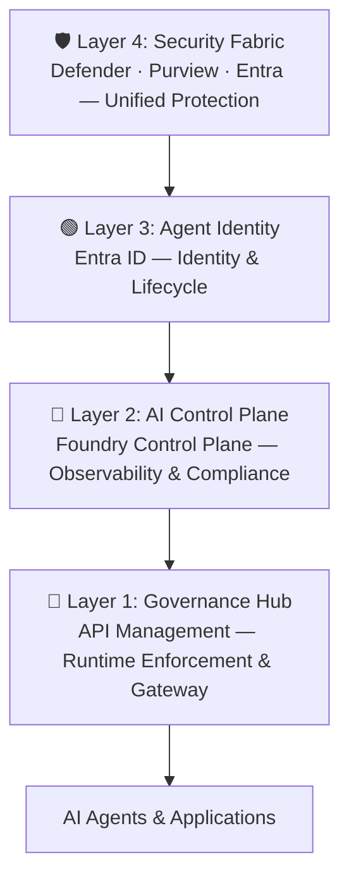

# 🏰 Citadel 4-Layer Architecture Model

## Overview

The **Foundry Citadel Platform** implements a unified, layered approach to AI security and governance. This architecture enables enterprises to scale AI innovation while maintaining trust, security, and regulatory compliance through **separation of concerns with unified oversight**.

## Architectural Philosophy

### Separation of Concerns with Unified Oversight

The four layers are not isolated silos—they form an integrated architecture where each layer owns a distinct governance responsibility, yet all layers interlock to deliver end-to-end trust:

| Principle | Description |
|-----------|-------------|
| **Separation of Concerns** | Each layer handles specific responsibilities (runtime, observability, identity, security) |
| **Unified Oversight** | All layers integrate to provide comprehensive governance visibility |
| **Composability** | Layers can evolve independently without destabilizing the entire stack |
| **Scalability** | Architecture scales from 10 to 10,000 agents consistently |

## The Four Layers

| Layer | Icon | Name | Responsibility | Key Components |
|-------|------|------|----------------|----------------|
| **1** | 🔷 | **Governance Hub** | Runtime enforcement — unified AI gateway, policy-as-code, identity validation, token rate limiting, content filtering, cost attribution | Azure API Management, API Center, Content Safety |
| **2** | 🔶 | **AI Control Plane** | Observability & compliance — agent traces, AI evaluations, fleet operations, automated compliance checks | Foundry Control Plane, evaluations, monitoring |
| **3** | 🟢 | **Agent Identity** | Agent identity & lifecycle — unique agent identities, shadow agent detection, sponsorship model, access packages | Microsoft Entra ID, Agent 365 |
| **4** | 🛡️ | **Security Fabric** | Unified protection — Microsoft Defender threat intelligence, Purview data governance, Entra access control | Defender, Purview, Entra |

## Layer Interactions

## Benefits of the Layered Approach

### 1. Governance-Velocity Paradox Resolution

Traditional governance creates bottlenecks:
- ❌ Manual risk assessments
- ❌ Scattered evaluation tools
- ❌ Unclear governance requirements
- ❌ Implementation gaps

Citadel's layered approach transforms this:
- ✅ Automated compliance checks
- ✅ Unified observability platform
- ✅ Codified governance contracts
- ✅ Pre-built, proven patterns

### 2. Scale with Confidence

| Capability | Traditional | Citadel Layered |
|------------|-------------|-----------------|
| Agent onboarding | Manual, slow | Automated, fast |
| Compliance | Reactive | Proactive by design |
| Observability | Fragmented | Unified |
| Security | Point solutions | Integrated fabric |

### 3. Enterprise-Grade Benefits

- **📈 Scale:** Grow from 10 to 10,000 agents with consistent governance
- **⚡ Speed:** Reduce compliance bottlenecks through automated enforcement
- **💰 Cost Control:** 20% reduction in regulatory expenses through effective governance
- **🛡️ Security:** 80% reduction in shadow AI-related data breach risk
- **🏆 Success:** 95% improvement in GenAI pilot success vs. ungoverned approaches

## Relationship to Microsoft Agent Factory

Citadel provides the **governance and security foundation** for Microsoft Agent Factory deployments. The Agent Factory brings together intelligence layers, builder platforms, and governance capabilities into a unified operating model for enterprise AI agents.

- **Citadel Layer 1** enforces runtime policies for agents built in Copilot Studio and Azure AI Foundry
- **Citadel Layer 2** provides observability and evaluations for Agent Factory workloads through the Foundry Control Plane
- **Citadel Layer 3** (Agent 365) manages agent identity and lifecycle across all builder platforms
- **Citadel Layer 4** secures the intelligence layers (Work IQ, Fabric IQ, Foundry IQ) with Defender and Purview

For a detailed breakdown of how the 8 agentic web stack components map to each Citadel layer, see the <a href="/agent-factory/agentic-web-stack">Agentic Web Stack</a> documentation and <a href="/agent-factory/agentic-stack-diagrams">architecture diagrams</a>.

For a deep dive into the design patterns that power enterprise agents, see the <a href="/agent-factory/design-patterns">Agentic Design Patterns</a> and <a href="/agent-factory/orchestration-patterns">Orchestration Patterns</a> guides.

<Card title="Agent Factory Mapping" href="/agent-factory/citadel-mapping" icon="factory">
  How Agent Factory maps to the 4-layer model
</Card>

## Relationship to Azure Landing Zones

Citadel integrates seamlessly with existing Azure Landing Zones as a **supplemental AI landing zone**:

### Integration Points

| Azure Landing Zone | Citadel Integration |
|--------------------|---------------------|
| **Network Topology** | Hub-spoke architecture aligns with ALZ networking |
| **Identity & Access** | Extends Entra ID governance to AI agents |
| **Security Controls** | Integrates Defender and Purview with AI workloads |
| **Policy Enforcement** | Azure Policy extends to AI-specific governance |
| **Monitoring** | Azure Monitor integration for unified observability |

### Deployment Models

Citadel supports two primary deployment approaches:

1. **Part of Hub Network:** Deploy within existing ALZ hub VNet for direct communication
2. **Dedicated Spoke:** Deploy in separate spoke VNet with peering to hub for additional isolation

## Layer Integration Matrix

Each layer integrates with all others to provide comprehensive coverage:

| Layer | Integrates With | Integration Purpose |
|-------|----------------|---------------------|
| **Layer 1** | Layers 2, 3, 4 | Provides runtime telemetry for observability, validates identities, receives threat intelligence |
| **Layer 2** | Layers 1, 3, 4 | Collects telemetry from gateway, uses identity for compliance, integrates security signals |
| **Layer 3** | Layers 1, 2, 4 | Enforces identity at gateway, registers with control plane, protected by security fabric |
| **Layer 4** | Layers 1, 2, 3 | Protects gateway, monitors control plane, governs agent identities |

## Detailed Layer Documentation

For comprehensive documentation of each layer, see:

- [Layer 1: Governance Hub](./layer-1-governance-hub) — Runtime enforcement and gateway
- [Layer 2: AI Control Plane](./layer-2-control-plane) — Observability and compliance
- [Layer 3: Agent Identity](./layer-3-agent-identity) — Agent lifecycle and identity
- [Layer 4: Security Fabric](./layer-4-security-fabric) — Unified security protection
- [Layer Integration](./layer-integration) — Cross-layer dependencies and data flows
- [Agent Factory on Citadel](/agent-factory/citadel-mapping) — How Agent Factory maps to the 4-layer model

<CardGroup>
  <Card title="Agentic Web Stack" href="/agent-factory/agentic-web-stack" icon="layers">
    The 8 essential components mapped to the 4-layer model
  </Card>
  <Card title="Design Patterns" href="/agent-factory/design-patterns" icon="wand-2">
    Tool use, reflection, and planning patterns mapped to Citadel
  </Card>
  <Card title="Orchestration Patterns" href="/agent-factory/orchestration-patterns" icon="git-branch">
    Multi-agent and ReAct patterns with architecture guidance
  </Card>
</CardGroup>

## Next Steps

- Learn about [Layer 1: Governance Hub](./layer-1-governance-hub) — the runtime enforcement foundation
- Explore [networking patterns](/guides/ai-landing-zone/network-approach) for hub-spoke deployment
- Review [deployment guides](/getting-started/quick-start) to implement the architecture
