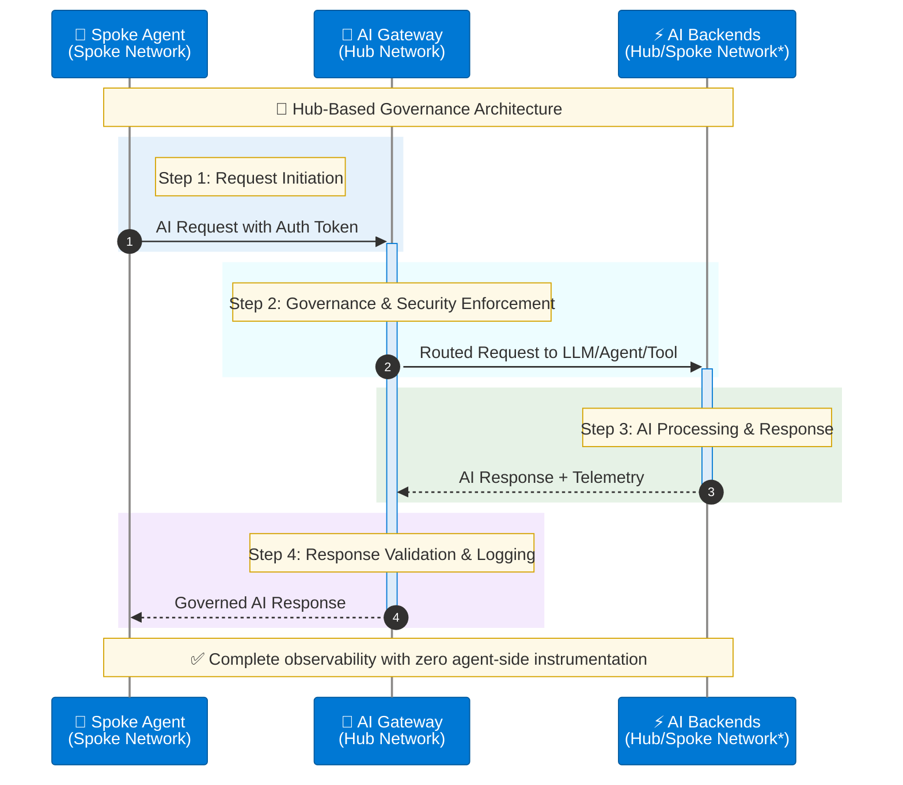
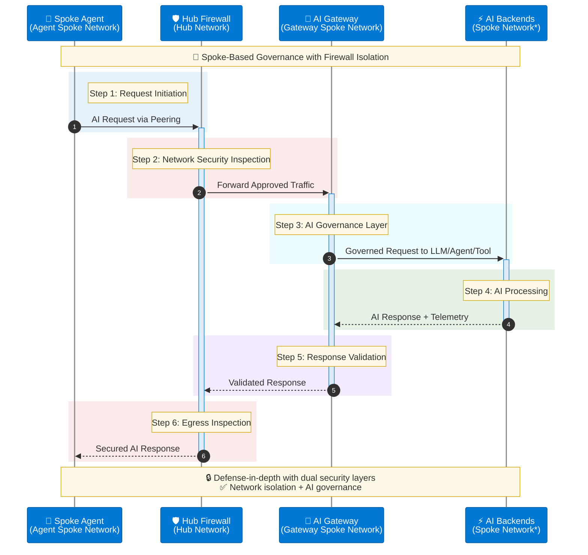

# Deployment Patterns

Citadel Governance Hub supports two primary deployment patterns for network integration. Choose the pattern that best fits your security requirements, compliance needs, and existing Azure Landing Zone architecture.

## Pattern Comparison

| Aspect | Part of Hub Network | Part of Spoke Network |
|--------|---------------------|----------------------|
| **Network Location** | Within existing hub VNet | Dedicated spoke VNet with peering |
| **Traffic Path** | Direct spoke-to-hub routing | Spoke → Hub Firewall → Gateway Spoke |
| **Security Layers** | Single (gateway policies) | Dual (firewall + gateway) |
| **Isolation Level** | Shared with hub services | Isolated AI workload network |
| **Complexity** | Lower | Higher |
| **Latency** | Lower | Slightly higher |
| **Best For** | Standard governance requirements | High-security, compliance scenarios |

## Pattern 1: Part of Hub Network

In this pattern, Citadel Governance Hub is deployed within the existing hub virtual network of your Azure Landing Zone.

### Architecture

```
┌─────────────────────────────────────────────────────────────────────────┐
│                     ENTERPRISE HUB VIRTUAL NETWORK                       │
│                                                                          │
│   ┌─────────────────────────────────────────────────────────────────┐   │
│   │                     CITADEL GOVERNANCE HUB                       │   │
│   │                                                                  │   │
│   │   ┌──────────────┐  ┌──────────────┐  ┌──────────────────────┐  │   │
│   │   │ AI Gateway   │  │ Policy Engine│  │  Observability       │  │   │
│   │   │ (APIM)       │  │ (Content     │  │  • Log Analytics     │  │   │
│   │   │              │  │  Safety)     │  │  • App Insights      │  │   │
│   │   │ • Routing    │  │              │  │  • Cosmos DB         │  │   │
│   │   │ • Rate Limit │  │ • Safety     │  │                      │  │   │
│   │   │ • Auth       │  │   Checks     │  │                      │  │   │
│   │   └──────┬───────┘  └──────────────┘  └──────────────────────┘  │   │
│   │          │                                                       │   │
│   └──────────┼───────────────────────────────────────────────────────┘   │
│              │                                                           │
│   ┌──────────┴───────────────────────────────────────────────────────┐   │
│   │                      SHARED SERVICES                              │   │
│   │   ┌──────────────┐  ┌──────────────┐  ┌──────────────────────┐  │   │
│   │   │ Azure AD DS  │  │   DNS        │  │  Azure Firewall      │  │   │
│   │   │              │  │              │  │  (Shared)            │  │   │
│   │   └──────────────┘  └──────────────┘  └──────────────────────┘  │   │
│   └──────────────────────────────────────────────────────────────────┘   │
│                                                                          │
└─────────────────────────────────────────────────────────────────────────┘
       │
       │  VNet Peering
       ▼
┌─────────────────────────────────┐
│      AGENT SPOKE NETWORK         │
│   ┌─────────────────────────┐   │
│   │    Agent Workloads      │   │
│   │   ┌─────────────────┐   │   │
│   │   │ 🤖 AI Agents    │───┘   │
│   │   └─────────────────┘       │
│   └─────────────────────────┘   │
└─────────────────────────────────┘
```

### Traffic Flow



### Deployment Configuration

```bicep
// Use existing hub VNet
param useExistingVnet = true
param vnetName = 'vnet-hub-eastus'
param existingVnetRG = 'rg-network-hub'

// Subnet names (must exist in hub VNet)
param apimSubnetName = 'snet-citadel-apim'
param privateEndpointSubnetName = 'snet-citadel-private-endpoints'
param functionAppSubnetName = 'snet-citadel-functions'

// DNS configuration
param dnsZoneRG = 'rg-network-hub'
param dnsSubscriptionId = '<hub-subscription-id>'

// Network security
param apimNetworkType = 'External'  // or 'Internal' for production
param apimV2UsePrivateEndpoint = true
```

### Advantages

| Benefit | Description |
|---------|-------------|
| **Simplified Routing** | Direct spoke-to-hub connectivity without firewall hop |
| **Lower Latency** | Single network hop for AI requests |
| **Leverages Existing Infrastructure** | Uses existing hub security configuration |
| **Easier Management** | Single VNet to manage for governance services |
| **Cost Efficient** | No additional VNet peering costs |

### Considerations

| Consideration | Recommendation |
|--------------|----------------|
| **Hub VNet Sizing** | Ensure sufficient address space for CGH subnets |
| **Subnet Requirements** | Create dedicated subnets for CGH services |
| **Security Boundaries** | Review if hub VNet security meets AI workload requirements |
| **Shared Resources** | Consider impact of AI workloads on existing hub services |

### When to Use

✅ **Ideal for:**
- Standard enterprise governance requirements
- Existing hub VNet with available address space
- Organizations prioritizing simplicity and lower latency
- Scenarios where CGH manages all enterprise AI traffic
- Direct spoke-to-hub connectivity requirements

### Prerequisites

1. **Hub VNet exists** with sufficient address space
2. **Dedicated subnets** created for:
   - API Management (/26 or larger)
   - Private Endpoints (/26 or larger)
   - Logic Apps/Functions (/26 or larger)
3. **Private DNS Zones** linked to hub VNet
4. **NSG rules** configured for APIM subnet (if VNet injection)
5. **Route table** with APIM control plane route (if applicable)

---

## Pattern 2: Part of Spoke Network

In this pattern, Citadel Governance Hub is deployed in a dedicated spoke VNet that connects to the hub VNet via VNet peering.

### Architecture

```
┌─────────────────────────────────────────────────────────────────────────┐
│                     ENTERPRISE HUB VIRTUAL NETWORK                       │
│                                                                          │
│   ┌─────────────────────────────────────────────────────────────────┐   │
│   │                      SHARED SERVICES                             │   │
│   │                                                                  │   │
│   │   ┌──────────────┐  ┌──────────────┐  ┌──────────────────────┐  │   │
│   │   │ Azure AD DS  │  │   DNS        │  │  AZURE FIREWALL      │  │   │
│   │   │              │  │   Servers    │  │                      │  │   │
│   │   │ • Identity   │  │              │  │  • Traffic Inspect   │  │   │
│   │   │ • AD Connect │  │ • Forwarding │  │  • Threat Intel      │  │   │
│   │   └──────────────┘  └──────────────┘  └──────────────────────┘  │   │
│   │                                                                  │   │
│   │                              │                                   │   │
│   └──────────────────────────────┼───────────────────────────────────┘   │
│                                  │                                       │
│                           VNet Peering                                  │
│                                  │                                       │
└──────────────────────────────────┼───────────────────────────────────────┘
                                   │
                                   ▼
┌─────────────────────────────────────────────────────────────────────────┐
│                CITADEL GOVERNANCE HUB (DEDICATED SPOKE)                  │
│                                                                          │
│   ┌─────────────────────────────────────────────────────────────────┐   │
│   │                     GATEWAY SPOKE VNET                           │   │
│   │                                                                  │   │
│   │   ┌──────────────┐  ┌──────────────┐  ┌──────────────────────┐  │   │
│   │   │ AI Gateway   │  │ Policy Engine│  │  Observability       │  │   │
│   │   │ (APIM)       │  │ (Content     │  │  • Log Analytics     │  │   │
│   │   │              │  │  Safety)     │  │  • App Insights      │  │   │
│   │   │ • Routing    │  │              │  │  • Cosmos DB         │  │   │
│   │   │ • Rate Limit │  │ • Safety     │  │                      │  │   │
│   │   │ • Auth       │  │   Checks     │  │                      │  │   │
│   │   └──────┬───────┘  └──────────────┘  └──────────────────────┘  │   │
│   │          │                                                       │   │
│   └──────────┼───────────────────────────────────────────────────────┘   │
│              │                                                           │
└──────────────┼───────────────────────────────────────────────────────────┘
               │
               │  VNet Peering
               ▼
┌─────────────────────────────────────────────────────────────────────────┐
│                      AGENT SPOKE NETWORKS                                │
│                                                                          │
│   ┌───────────────────┐  ┌───────────────────┐  ┌───────────────────┐  │
│   │  Finance Spoke    │  │  HR Spoke         │  │  Legal Spoke      │  │
│   │  🤖 AI Agents     │  │  🤖 AI Agents     │  │  🤖 AI Agents     │  │
│   └───────────────────┘  └───────────────────┘  └───────────────────┘  │
│                                                                          │
└─────────────────────────────────────────────────────────────────────────┘
```

### Traffic Flow



### Deployment Configuration

```bicep
// Create new spoke VNet
param useExistingVnet = false
param vnetName = 'vnet-citadel-gateway-eastus'
param vnetAddressPrefix = '10.170.0.0/24'

// Subnet prefixes
param apimSubnetPrefix = '10.170.0.0/26'
param privateEndpointSubnetPrefix = '10.170.0.64/26'
param functionAppSubnetPrefix = '10.170.0.128/26'

// DNS configuration (zones in hub)
param dnsZoneRG = 'rg-network-hub'
param dnsSubscriptionId = '<hub-subscription-id>'

// Post-deployment: Configure VNet peering to hub
// and User Defined Routes (UDRs) via Azure Firewall
```

### Post-Deployment VNet Peering

```powershell
# Hub to Gateway Spoke Peering
$hubVnet = Get-AzVirtualNetwork -Name "vnet-hub-eastus" -ResourceGroupName "rg-network-hub"
$gatewayVnet = Get-AzVirtualNetwork -Name "vnet-citadel-gateway-eastus" -ResourceGroupName "rg-citadel-hub"

# Hub -> Gateway Spoke
Add-AzVirtualNetworkPeering `
    -Name "hub-to-citadel-gateway" `
    -VirtualNetwork $hubVnet `
    -RemoteVirtualNetworkId $gatewayVnet.Id `
    -AllowForwardedTraffic `
    -AllowGatewayTransit

# Gateway Spoke -> Hub (use remote gateways)
Add-AzVirtualNetworkPeering `
    -Name "citadel-gateway-to-hub" `
    -VirtualNetwork $gatewayVnet `
    -RemoteVirtualNetworkId $hubVnet.Id `
    -UseRemoteGateways
```

### Advantages

| Benefit | Description |
|---------|-------------|
| **Defense in Depth** | Dual security inspection (firewall + gateway) |
| **Network Isolation** | AI workloads isolated from general traffic |
| **Compliance Ready** | Meets strict network segmentation requirements |
| **Independent Scaling** | Spoke resources scale independently from hub |
| **Clear Boundaries** | Well-defined security and management perimeters |

### Considerations

| Consideration | Recommendation |
|--------------|----------------|
| **Additional Complexity** | Requires VNet peering and UDR configuration |
| **Slightly Higher Latency** | Extra network hop through firewall |
| **Peering Costs** | VNet peering data transfer charges |
| **Route Table Management** | UDRs required to force traffic through firewall |

### When to Use

✅ **Ideal for:**
- High-security environments requiring defense-in-depth
- Compliance requirements for network isolation
- Separate cost centers or subscriptions for AI workloads
- Scenarios requiring firewall inspection of all AI traffic
- Organizations with strict network segmentation policies

### Prerequisites

1. **New VNet** with /24 or larger address space
2. **Hub VNet** with Azure Firewall deployed
3. **VNet peering** configured (hub ↔ gateway spoke)
4. **User Defined Routes** forcing traffic through Azure Firewall
5. **Private DNS Zones** linked to gateway spoke VNet

---

## Decision Matrix

Use this matrix to choose the right deployment pattern:

| Factor | Hub Network | Spoke Network |
|--------|:-----------:|:-------------:|
| **Security Requirements** | Standard | High/Compliance |
| **Latency Sensitivity** | Low latency needed | Tolerates slight increase |
| **Hub VNet Capacity** | Available space | Limited space |
| **Compliance Standards** | Standard | SOC 2, HIPAA, PCI-DSS |
| **AI Workload Isolation** | Not required | Required |
| **Operational Simplicity** | Preferred | Accept complexity |
| **Existing Firewall** | Shared sufficient | Dedicated needed |
| **Cost Optimization** | Lower priority | Accept additional cost |

### Decision Tree

```
Start
  │
  ├── Do you require firewall inspection of ALL AI traffic?
  │   ├── YES → Spoke Network Pattern
  │   └── NO
  │       │
  │       ├── Do you have strict compliance requirements (SOC 2, HIPAA)?
  │       │   ├── YES → Spoke Network Pattern
  │       │   └── NO
  │       │       │
  │       │       ├── Does your hub VNet have available address space?
  │       │       │   ├── YES → Hub Network Pattern (Simpler)
  │       │       │   └── NO → Spoke Network Pattern
  │       │       │
  │       │       └── Is low latency critical?
  │       │           ├── YES → Hub Network Pattern
  │       │           └── NO → Either pattern works
```

## Migration Between Patterns

### Hub Network → Spoke Network

1. **Provision new spoke VNet** with required subnets
2. **Configure VNet peering** between hub and new spoke
3. **Deploy parallel CGH** in spoke VNet
4. **Test connectivity** from spokes to new CGH
5. **Migrate traffic** by updating spoke route tables
6. **Decommission** hub-based CGH services

### Spoke Network → Hub Network

1. **Validate hub VNet** has available address space
2. **Create CGH subnets** in hub VNet
3. **Deploy CGH services** in hub VNet
4. **Update DNS records** to point to hub CGH endpoints
5. **Migrate traffic** by updating spoke configurations
6. **Decommission** spoke-based CGH

## Implementation Guidance

<CardGroup>
  <Card title="Network Approach Guide" href="/guides/network-approach" icon="book">
    Step-by-step deployment guidance for both patterns
  </Card>
  <Card title="Network Topology" href="/architecture/network-topology" icon="network-wired">
    Detailed VNet and subnet design specifications
  </Card>
  <Card title="VNet Peering" href="/architecture/vnet-peering" icon="link">
    Connectivity and routing configuration
  </Card>
  <Card title="Network Security" href="/architecture/network-security" icon="shield">
    Security controls and best practices
  </Card>
</CardGroup>
