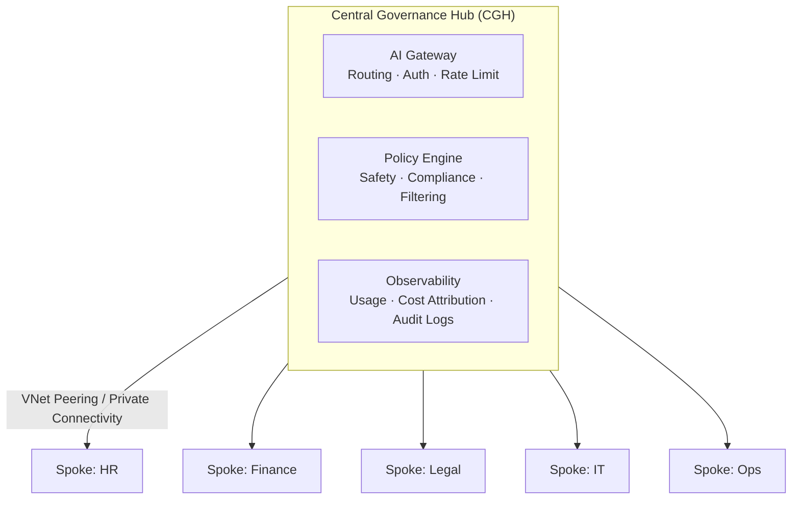
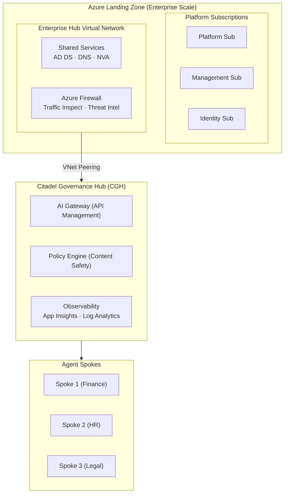

# Hub-Spoke Architecture Overview

The Citadel Governance Hub implements a **hub-spoke architecture** that provides centralized governance while enabling distributed AI development across your organization. This pattern aligns with Microsoft's Azure Landing Zone architecture and supports enterprise-scale AI governance.

## Architecture Principles

The hub-spoke model for AI governance is built on four core principles:

<CardGroup>
  <Card title="Separation of Concerns" icon="layer-group">
    Central governance layer (CGH) handles security, observability, and policy enforcement, while spokes focus on AI workload development
  </Card>
  <Card title="Unified Oversight" icon="eye">
    Single control plane provides visibility and governance across all AI consumption, regardless of where agents are deployed
  </Card>
  <Card title="Local Freedom" icon="rocket">
    Business units maintain autonomy over their AI workloads within centrally-defined guardrails
  </Card>
  <Card title="Defense in Depth" icon="shield-halved">
    Layered security with network isolation, private connectivity, and centralized policy enforcement
  </Card>
</CardGroup>

## Core Components

### Central Governance Hub (CGH)

The **Citadel Governance Hub** is the central control plane that governs all AI traffic across the organization:

| Component | Purpose | Responsibility |
|-----------|---------|----------------|
| **AI Gateway** | Unified entry point for all AI requests | Authentication, routing, rate limiting, token quotas |
| **Policy Engine** | Governance rule enforcement | Content filtering, safety checks, compliance validation |
| **Observability** | Usage tracking and monitoring | Cost attribution, performance metrics, audit logging |
| **AI Registry** | Catalog of AI services and tools | Discovery, versioning, access management |

<Tip>
  One CGH deployment serves multiple spokes. Deploy one hub per environment (dev, staging, production) for centralized governance.
</Tip>

### Agent Environment Spokes (CAS)

**Citadel Agent Spokes** are isolated environments where AI agents and applications are developed and deployed:

| Spoke Type | Use Case | Deployment Pattern |
|------------|----------|-------------------|
| **Business Unit Spoke** | Department-specific AI workloads | One spoke per BU (Finance, HR, Legal) |
| **Project Spoke** | Individual AI projects or pilots | Temporary spokes for experimentation |
| **Multi-Agent Spoke** | Complex multi-agent systems | Dedicated infrastructure for agent orchestration |

## Hub-Spoke Relationships

### One-to-Many Governance Model

### Traffic Flow Pattern

1. **Request Initiation**: Spoke-hosted agents send AI requests to the CGH gateway
2. **Governance Enforcement**: Gateway applies policies (auth, rate limits, safety checks)
3. **Intelligent Routing**: Requests routed to appropriate LLM, tool, or downstream agent
4. **Response Validation**: Gateway validates and logs responses before returning to spoke
5. **Observability**: All traffic logged for audit, cost attribution, and monitoring

## Benefits for AI Governance

### Centralized Control

| Challenge | Hub-Spoke Solution |
|-----------|-------------------|
| **Shadow AI** | All AI traffic flows through governed gateway |
| **Cost Sprawl** | Centralized usage tracking and budget enforcement |
| **Security Gaps** | Consistent security policies across all AI workloads |
| **Compliance Burden** | Single audit point for AI governance compliance |

### Developer Velocity

- **Self-service onboarding**: Teams request AI access through standardized contracts
- **Pre-approved patterns**: Common AI architectures available as templates
- **Shared infrastructure**: Centralized LLM access reduces redundant deployments
- **Faster iteration**: Spoke autonomy enables rapid development within guardrails

### Operational Efficiency

- **Reduced overhead**: One CGH manages governance for many spokes
- **Economies of scale**: Shared LLM backends, security services, and observability
- **Simplified operations**: Centralized monitoring and alerting
- **Consistent standards**: Reusable policies and compliance frameworks

## Comparison with Alternative Patterns

### Hub-Spoke vs. Flat Network

| Aspect | Hub-Spoke | Flat Network |
|--------|-----------|--------------|
| **Governance** | Centralized enforcement | Distributed, inconsistent |
| **Security** | Defense in depth | Single perimeter |
| **Scaling** | Add spokes without hub changes | Network complexity grows |
| **Cost Tracking** | Centralized attribution | Difficult to allocate |

### Hub-Spoke vs. Mesh

| Aspect | Hub-Spoke | Full Mesh |
|--------|-----------|-----------|
| **Complexity** | Linear (hub + n spokes) | Quadratic (n² connections) |
| **Governance** | Single enforcement point | Multiple enforcement points |
| **Latency** | Predictable (via hub) | Variable (direct paths) |
| **Management** | Centralized | Distributed |

## Integration with Azure Landing Zones

The Citadel hub-spoke model extends your existing Azure Landing Zone architecture:

### Alignment with ALZ Design Areas

| ALZ Design Area | Citadel Integration |
|-----------------|---------------------|
| **Enterprise Enrollment** | CGH deployed under enterprise billing and policy |
| **Identity & Access Management** | Entra ID integration for agent authentication |
| **Network Topology** | VNet peering with hub VNet for connectivity |
| **Resource Organization** | Resource groups following ALZ naming conventions |
| **Governance Disciplines** | Azure Policy inheritance from management groups |
| **Operations Baseline** | Integration with centralized monitoring and logging |
| **Business Continuity** | Multi-region CGH for disaster recovery |

## Next Steps

<CardGroup>
  <Card title="Network Topology" href="/architecture/network-topology" icon="network-wired">
    Explore detailed VNet and subnet design for hub and spoke networks
  </Card>
  <Card title="Deployment Patterns" href="/architecture/deployment-patterns" icon="server">
    Compare hub-network vs spoke-network deployment approaches
  </Card>
  <Card title="Network Security" href="/architecture/network-security" icon="shield">
    Review security controls and network protection patterns
  </Card>
  <Card title="Network Approach Guide" href="/guides/network-approach" icon="book">
    Step-by-step implementation guidance for network setup
  </Card>
</CardGroup>

## Related Documentation

- [Network Topology](/architecture/network-topology) - Detailed VNet and subnet configuration
- [Deployment Patterns](/architecture/deployment-patterns) - Choosing between deployment approaches
- [Network Security](/architecture/network-security) - Security controls and best practices
- [VNet Peering](/architecture/vnet-peering) - Connectivity patterns and routing
- [Network Approach Guide](/guides/network-approach) - Implementation guidance
