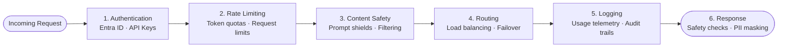
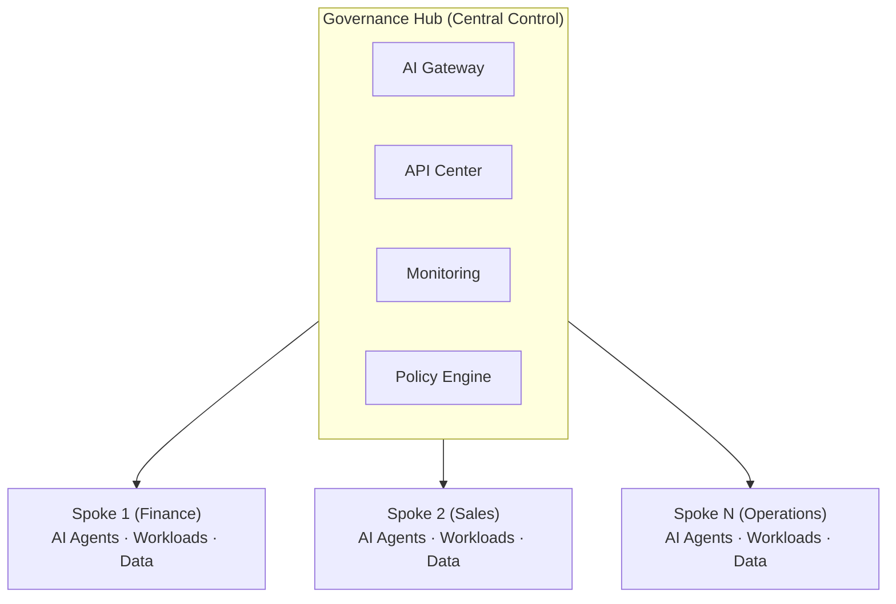

# 🔷 Layer 1: Governance Hub

## Overview

**Layer 1 — Governance Hub** serves as the **runtime enforcement plane** that mediates all AI traffic between agents, LLMs, tools, and other agents. It establishes the physical gateway through which every AI interaction flows, ensuring consistent policy enforcement across the enterprise.

## Strategic Purpose

The Governance Hub addresses the critical reality that in an AI system, three primary assets must be governed:

| Asset | Description | Governance Need |
|-------|-------------|-----------------|
| 🧠 **LLMs** | Provide the cognitive capabilities for AI agents | Access control, rate limiting, cost attribution |
| 🧰 **Tools & Knowledge** | Allow agents to be grounded with actionable capabilities | Registry, discovery, usage tracking |
| 🤖 **External Agents** | Enable collaboration as AI systems grow | Inter-agent communication, trust boundaries |

Without runtime governance, organizations face:

- 💸 **Unpredictable costs** — Uncontrolled token consumption and API usage
- ⚠️ **Reliability issues** — No failover, circuit breaking, or traffic management
- 🔓 **Security threats** — Exposed credentials, unauthorized access, data leakage
- 😤 **Developer friction** — Fragmented access patterns, manual onboarding
- 😱 **Governance nightmares** — No audit trails, compliance gaps, shadow AI

## Core Components

### 🌐 Unified AI Gateway

Built on **Azure API Management**, the Unified AI Gateway is the central control point for all AI consumption:

| Capability | Description |
|------------|-------------|
| **Single Entry Point** | All AI requests route through one controlled gateway |
| **Protocol Support** | OpenAI-compatible APIs, REST, and emerging protocols |
| **Multi-Cloud** | Front Azure OpenAI, open-source models, or third-party services (e.g., Amazon Bedrock) |
| **Self-Hosted Option** | APIM self-hosted gateways for data residency requirements |

#### Gateway Features

### 📖 Universal Registry (Azure API Center)

The Universal Registry provides centralized catalog and discovery for all AI capabilities:

| Function | Description |
|----------|-------------|
| **AI Registry** | Catalog of LLMs, tools, agents, and MCP servers |
| **Discovery** | Teams can find and reuse approved AI capabilities |
| **Governance** | Metadata and policies attached to each registered item |
| **Versioning** | Track versions and lifecycle of AI assets |

### 🛡️ Enforcement Capabilities

#### Identity Validation

- **Entra ID Integration** — Enterprise identity validation
- **Gateway Keys** — Scoped access tokens for applications
- **Managed Identities** — Zero-credential service authentication

#### Smart Operations

| Feature | Purpose |
|---------|---------|
| **Token Rate Limiting** | Prevent cost overruns and abuse |
| **Semantic Caching** | Reduce costs and improve latency |
| **Cost Attribution** | Track usage by team, project, or application |
| **Circuit Breaking** | Handle backend failures gracefully |
| **Load Balancing** | Distribute traffic across model endpoints |

#### Safety & Security

| Feature | Description |
|---------|-------------|
| **Content Filtering** | Azure AI Content Safety integration |
| **Prompt Shields** | Detect jailbreak attempts and prompt injection |
| **PII Detection** | Microsoft Language Service for sensitive data |
| **Protected Content** | Block copyrighted material in outputs |

## Hub-and-Spoke Deployment Model

The Governance Hub implements a **hub-and-spoke architecture** that provides central governance with local autonomy:

### Central Governance Hub

Deployed centrally to serve as the runtime command center:

- Unified AI gateway for all model, tool, and agent access
- Universal AI registry for centralized catalog and discovery
- Centralized logging, monitoring, and policy enforcement
- Shared infrastructure that every project leverages

### Agent Environment Spokes

Deployed multiple times, one for each business unit or use case:

- Fully self-contained with dedicated compute, storage, and data
- Teams work autonomously without interference
- Each spoke connects back to the hub for governance and observability

## Governance & Security Pillar Alignment

Layer 1 directly implements the **Governance & Security Pillar** of the Foundry Citadel Platform:

| Pillar Capability | Layer 1 Implementation |
|-------------------|------------------------|
| **Unified AI Gateway** | Azure API Management with intelligent routing |
| **Policy Engine** | Rich rule framework for traffic mediation |
| **Managed Credentials** | Gateway keys with scoped access |
| **Content Safety Filters** | Azure AI Content Safety integration |
| **AI Registry & Catalog** | Azure API Center for discovery |
| **Multi-cloud Connectors** | Gateway proxying to heterogeneous AI services |
| **Azure Key Vault** | Secure credential storage |

## Integration with Other Layers

### Layer 2: AI Control Plane

- **Telemetry Collection** — Gateway provides runtime data for observability
- **Compliance Monitoring** — Usage patterns feed into compliance dashboards
- **Evaluation Data** — Request/response logs enable AI evaluations

### Layer 3: Agent Identity

- **Identity Validation** — Gateway validates Agent 365 identities
- **Access Control** — Entra ID tokens checked at the gateway
- **Lifecycle Integration** — Disabled agents blocked at gateway level

### Layer 4: Security Fabric

- **Defender Integration** — Runtime threat detection at the gateway
- **Purview Policies** — Data governance enforced on traffic
- **Entra Signals** — Identity-based security events

## Key Enterprise Features

| Feature | Benefit |
|---------|---------|
| **Centralized Oversight** | Single control plane for all AI consumption |
| **Consistent Policies** | Organization-wide guardrails automatically applied |
| **Cost Transparency** | Detailed usage tracking and attribution |
| **Security by Default** | Every request authenticated, authorized, and logged |
| **Developer Experience** | Self-service onboarding through access contracts |
| **Audit Readiness** | Complete audit trails for compliance |

## Implementation Reference

For detailed deployment guidance, see:

- [AI Hub Gateway Repository](https://aka.ms/ai-hub-gateway) — Reference implementation
- [Quick Deployment Guide](/getting-started/quick-start) — Fast path to deployment
- [Network Approach](/guides/ai-landing-zone/network-approach) — Networking patterns
- [Access Contracts](/governance/access-contracts) — Agent onboarding

## Next Steps

- Explore [Layer 2: AI Control Plane](./layer-2-control-plane) for observability and compliance
- Learn about [Citadel Access Contracts](/governance/access-contracts) for agent onboarding
- Review [networking patterns](/guides/ai-landing-zone/network-approach) for hub-spoke deployment
