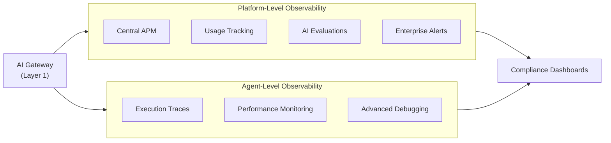

# 🔶 Layer 2: AI Control Plane

## Overview

**Layer 2 — AI Control Plane** provides the **observability and compliance brain** of the SOF1A 2.0 AI Governance Platform. Powered by **Microsoft Foundry Control Plane**, this layer continuously evaluates agent behavior, captures end-to-end traces, runs automated red-teaming, and powers fleet operations dashboards—turning raw telemetry from every spoke into actionable governance insights.

The Foundry Control Plane also serves as the **observability and compliance brain for Agent Factory workloads**, enabling unified evaluation and monitoring across Copilot Studio agents, Foundry-hosted agents, and Agent 365 identities.

## Strategic Purpose

> *"Full Visibility = Trust & Confidence"*

Citadel provides holistic observability for AI systems through a **dual-layer approach**: centralized monitoring at the platform level and detailed tracing at the agent level. This ensures teams can debug issues, assure quality, and govern compliance in real time.

## Core Functionalities

### 📋 Controls

Define and enforce AI evaluations and compliance policies:

| Control Type | Description |
|--------------|-------------|
| **AI Evaluations** | Automated assessment of agent outputs against quality and safety metrics |
| **Compliance Policies** | Codified rules aligned with regulatory requirements |
| **Red Teaming** | Automated adversarial testing for safety vulnerabilities |
| **Drift Monitoring** | Detection of behavioral changes over time |

### 🔭 Observability

#### Platform-Level Observability

Provides enterprise-grade visibility without requiring agent code changes:

| Feature | Description |
|---------|-------------|
| **Central APM** | Azure Monitor Application Insights integration |
| **Usage Tracking** | Token consumption, request volumes, cost allocation |
| **Centralized AI Evaluation** | Automated evaluation without code modifications |
| **Enterprise Alerts** | Configurable alerts with automated remediation |

**Evaluation Metrics Include:**

- **Response Quality:** Groundedness, relevance, coherence, completeness
- **Retrieval Accuracy:** Truthfulness to source documents
- **Safety Metrics:** Harm detection, bias, jailbreak susceptibility

#### Agent-Level Observability

Provides detailed, granular insights into individual agent behavior:

| Feature | Description |
|---------|-------------|
| **Execution Traces** | Every step of agent reasoning and tool usage |
| **Performance Monitoring** | Latency breakdown, token usage, tool efficiency |
| **Agent-Specific Evaluations** | Intent fulfillment, tool correctness |
| **Advanced Debugging** | Query, filter, and replay traces |

### 🔐 Security

| Capability | Description |
|------------|-------------|
| **Zero Trust Architecture** | Continuous verification of agent behavior |
| **Security Fabric Integration** | Defender and Entra signals for threat detection |
| **AI Red Teaming** | Automated adversarial testing |
| **Drift Monitoring** | Detect behavioral anomalies |

### 🚀 Fleet Operations

Manage agent ecosystem at scale:

| Capability | Description |
|------------|-------------|
| **Agent Tracking** | 100% visibility of registered agents |
| **Lifecycle Management** | Activation, versioning, retirement workflows |
| **Fleet Health** | Visualize health and anomalies across all agents |
| **Compliance Dashboards** | Real-time compliance status across the fleet |

## Agent Factory Integration

The AI Control Plane is the observability and compliance brain for  Agent Factory workloads. It unifies evaluation and monitoring across all builder platforms and intelligence layers.

| Agent Factory Element | Layer 2 Capability | Value |
|-----------------------|-------------------|-------|
| **Foundry-hosted agents** | Execution traces, evaluations | End-to-end quality assurance |
| **Copilot Studio agents** | Usage tracking, compliance checks | Unified observability across platforms |
| **Agent 365 identity** | Lifecycle + access correlation | Track agent behavior by identity |
| **Work IQ / Fabric IQ** | Data access telemetry | Monitor what intelligence agents consume |

## Observability Layers

### Platform vs. Agent Observability

| Aspect | Platform Level | Agent Level |
|--------|----------------|-------------|
| **Scope** | All agents and workloads | Individual agent behavior |
| **Code Changes** | Not required | Instrumentation needed |
| **Metrics** | Usage, cost, performance | Reasoning steps, tool calls |
| **Use Case** | Operations, compliance | Debugging, optimization |

### Unified Dashboards

Ready-to-use dashboards provide both platform-wide overviews and agent-specific drill-downs:



## Integration with Partner Ecosystem

| Partner | Capabilities |
|---------|--------------|
| **Credo AI** | Policy-to-code translation, governance-ready artifacts, real-time evaluator feedback |
| **Saidot** | EU AI Act-focused risk evaluations, dataset simulation, compliance mapping |

## Integration with Other Layers

### Layer 1: Governance Hub

- **Telemetry Source** — Collects runtime data from the AI Gateway
- **Policy Feedback** — Evaluation results inform gateway policies
- **Compliance Monitoring** — Usage patterns tracked for compliance

<Note>
**Data Foundation: Unified Observability for Data Access Workloads**

The Databricks SQL REST API semantic endpoint — fronted by APIM at Layer 1 — emits query-count
and warehouse-id telemetry to the same Event Hub namespace monitored by the AI Control Plane.
This enables unified observability across LLM token consumption and structured data access in a
single compliance dashboard. See [APIM Governed Data Access](../data-foundation/apim-semantic-endpoint)
for the usage tracking schema and data access policy fragment design.
</Note>

### Layer 3: Agent Identity

- **Identity Context** — Uses Agent 365 identity for compliance tracking
- **Lifecycle Integration** — Monitors agent activation and retirement
- **Access Correlation** — Links agent behavior to identity permissions

### Layer 4: Security Fabric

- **Threat Intelligence** — Integrates Defender signals for threat detection
- **Data Governance** — Uses Purview insights for compliance evaluation
- **Identity Security** — Entra signals for anomalous access patterns

## Key Observability Tools

| Tool | Purpose | Layer |
|------|---------|-------|
| **Central APM** | Infrastructure monitoring | Platform |
| **Usage Analytics** | Cost and usage tracking | Platform |
| **AI Evaluations** | Quality and safety assessment | Platform |
| **Enterprise Alerts** | Automated alerting and response | Platform |
| **Execution Tracing** | End-to-end agent debugging | Agent |
| **Performance Monitoring** | Latency and efficiency metrics | Agent |
| **Debug Tools** | Root cause analysis | Agent |
| **Unified Dashboards** | Integrated visibility | Both |
| **CI/CD Integration** | Continuous improvement | Both |

## Evaluation Framework

### Automated AI Evaluations

The AI Control Plane runs comprehensive evaluations without requiring agent code changes:

```
Evaluation Pipeline:
1. Intercept agent outputs
2. Apply evaluation metrics
3. Calculate quality scores
4. Store results
5. Trigger alerts if needed
6. Update compliance dashboards
```

### Continuous Improvement Integration

| Integration Point | Capability |
|-------------------|------------|
| **CI/CD Pipelines** | Automated testing on deployment |
| **A/B Testing** | Compare agent versions |
| **Regression Detection** | Identify performance degradations |
| **Feedback Loops** | Production insights inform development |

## Benefits

| Benefit | Description |
|---------|-------------|
| **Reliability** | Proactive issue detection and debugging |
| **Accountability** | Complete audit trails of agent behavior |
| **Quality Assurance** | Consistent evaluation across all agents |
| **Compliance** | Automated compliance monitoring and reporting |
| **Optimization** | Data-driven agent improvements |

## Next Steps

- Learn about [Layer 3: Agent Identity](./layer-3-agent-identity) for agent lifecycle management
- Explore [Agent Factory mapping](/agent-factory/citadel-mapping) to understand the full integration
- Explore [Foundry Control Plane Integration](../implementation/integration/foundry-control-plane) for implementation guidance
- Review [AI Evaluations](/guides/citadel-hub/operations/usage-analytics) for quality assurance
- Review [monitoring dashboards](../guides/citadel-hub/operations/usage-analytics) for operational visibility
