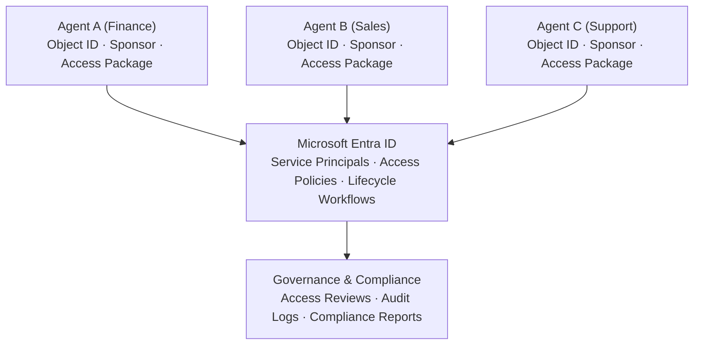

# 🟢 Layer 3: Agent Identity (Agent 365)

## Overview

**Layer 3 — Agent Identity (Agent 365)** is the **identity and lifecycle layer** of the SOF1A 2.0 AI Governance Platform. It transforms agents into enterprise assets with **unique identities, lifecycle management, and access controls**. Built on **Microsoft Entra ID**, this layer addresses shadow AI and enables scale with trust by ensuring no agent operates anonymously at scale.

## Strategic Significance

### The Shadow AI Problem

Organizations face significant challenges with ungoverned AI:

| Challenge | Impact |
|-----------|--------|
| **Unmanaged Agents** | No visibility into what agents are accessing |
| **Anonymous Operations** | No accountability for agent actions |
| **Access Proliferation** | Unchecked permissions to sensitive data |
| **Compliance Gaps** | No audit trails for regulatory requirements |

### Agent 365 Solution

Agent 365 provides a comprehensive identity platform for AI agents:

- **Unique Identities** — Every agent has a distinct identity in Entra ID
- **Lifecycle Management** — Complete control over agent creation, activation, and retirement
- **Human Accountability** — Sponsorship model ensures human ownership
- **Access Governance** — Role-based and attribute-based access control

## Core Capabilities

### 🆔 Agent Identity Platform (Microsoft Entra ID)

#### Unique Agent Identities

Every agent receives a unique identity in Microsoft Entra ID:

| Attribute | Purpose |
|-----------|---------|
| **Object ID** | Unique identifier for the agent |
| **Display Name** | Human-readable agent name |
| **Service Principal** | Security context for agent operations |
| **Metadata** | Agent type, version, ownership |

#### Shadow Agent Detection

Automatically discover and catalog unmanaged agents:

```
Shadow Agent Detection Process:
1. Scan network traffic for AI agent signatures
2. Identify unregistered agent activities
3. Alert security teams
4. Guide through registration process
5. Integrate into governance framework
```

#### Lifecycle and Ownership Management

| Stage | Activities |
|-------|------------|
| **Creation** | Register agent identity, assign sponsor |
| **Activation** | Enable agent for production use |
| **Monitoring** | Track agent behavior and compliance |
| **Review** | Periodic access reviews and certification |
| **Retirement** | Decommission and archive agent identity |

#### Sponsorship Model

Every agent has a human sponsor accountable for its behavior:

| Element | Description |
|---------|-------------|
| **Sponsor** | Human owner (typically developer or team lead) |
| **Responsibilities** | Agent behavior, compliance, updates |
| **Delegation** | Secondary contacts for operational tasks |
| **Attestation** | Regular confirmation of agent necessity |

### 🔐 Access Management

#### Access Packages

Pre-configured bundles of permissions for common agent scenarios:

```
Example Access Packages:
• Basic AI Access — LLM APIs, standard tools
• Document Processing — RAG capabilities, storage access
• External Integration — Third-party API access
• Administrative — Management and monitoring tools
```

#### Role-Based Access Control (RBAC)

| Role | Permissions |
|------|-------------|
| **Agent Developer** | Create, test, deploy agents |
| **Agent Operator** | Monitor, troubleshoot, update |
| **Compliance Officer** | Review, audit, enforce policies |
| **Administrator** | Full lifecycle management |

#### Attribute-Based Access Control (ABAC)

Fine-grained permissions based on agent attributes:

| Attribute | Access Control |
|-----------|----------------|
| **Agent Type** | Restrictions based on agent capabilities |
| **Data Sensitivity** | Limits on PII or confidential data |
| **Environment** | Dev vs. production access |
| **Time** | Scheduled access windows |

#### Expiration and Review Workflows

| Workflow | Purpose |
|----------|---------|
| **Access Reviews** | Periodic certification of agent permissions |
| **Expiration Policies** | Time-bound access requiring renewal |
| **Conditional Access** | Dynamic access based on risk signals |
| **Emergency Revocation** | Rapid deactivation of compromised agents |

## Agent Identity Architecture



## Integration with Other Layers

### Layer 1: Governance Hub

- **Identity Validation** — Gateway validates Agent 365 identities on each request
- **Access Enforcement** — Token-based access control at the gateway
- **Policy Integration** — Agent identity informs gateway policies

### Layer 2: AI Control Plane

- **Identity Registration** — Foundry agents register with Agent 365
- **Compliance Tracking** — Agent identity enables per-agent compliance monitoring
- **Audit Correlation** — All agent actions linked to identity

### Layer 4: Security Fabric

- **Entra Integration** — Identity governance through Entra ID
- **Defender Signals** — Anomalous agent behavior detected by Defender
- **Purview Correlation** — Data access linked to agent identity

## Benefits for Enterprise AI Governance

| Benefit | Description |
|---------|-------------|
| **Accountability** | Every agent has a human sponsor responsible for its behavior |
| **Visibility** | Complete inventory of all agents across the enterprise |
| **Security** | Identity-based access control prevents unauthorized operations |
| **Compliance** | Audit trails linked to specific agent identities |
| **Scale** | Automated lifecycle management for thousands of agents |
| **Trust** | Stakeholders can verify agent legitimacy and ownership |

## Key Scenarios

### Scenario 1: New Agent Onboarding

```
1. Developer creates agent in development environment
2. Registers agent with Agent 365
3. Assigns sponsor and access package
4. Submits for approval
5. Upon approval, agent identity activated
6. Agent can now authenticate through gateway
```

### Scenario 2: Shadow Agent Discovery

```
1. Defender detects unregistered agent activity
2. Alert sent to security team
3. Agent traced to developer workstation
4. Developer guided to register agent
5. Agent integrated into governance framework
```

### Scenario 3: Access Review

```
1. Quarterly access review initiated
2. Sponsors attest to agent necessity
3. Unused agents identified for retirement
4. Excessive permissions flagged for reduction
5. Compliance team reviews exceptions
```

## Implementation Resources

For technical implementation details, see:

- [Microsoft Entra Agent Identity Documentation](https://learn.microsoft.com/en-us/entra/id-governance/agent-id-governance-overview)
- [Agent Lifecycle Management](/guides/citadel-hub/common-issues)
- [Access Package Configuration](/governance/access-contracts)

## Next Steps

- Explore [Layer 4: Security Fabric](./layer-4-security-fabric) for unified protection
- Learn about [agent onboarding](/getting-started/quick-start) workflows
- Review [compliance monitoring](/guides/citadel-hub/operations/usage-analytics) capabilities
