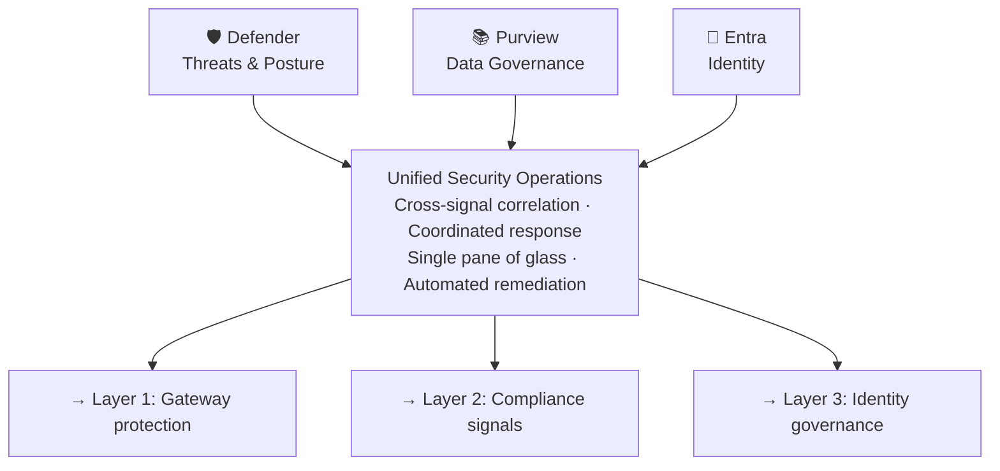
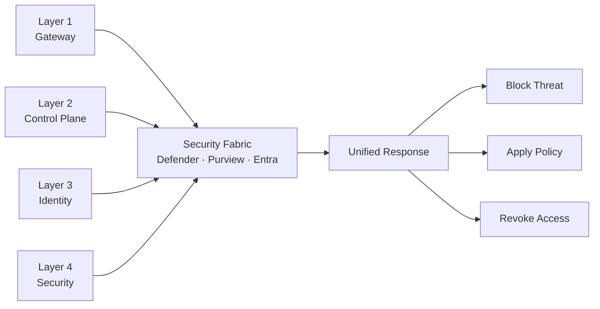

# 🛡️ Layer 4: Security Fabric

## Overview

**Layer 4 — Security Fabric** provides **real-time defense against AI-specific threats** and integrates across all governance layers. By weaving together **Microsoft Defender**, **Microsoft Purview**, and **Microsoft Entra**, this layer delivers unified protection that closes the loop from policy definition to runtime defense.

## Strategic Purpose

AI systems face unique security challenges that traditional security tools cannot adequately address:

| Threat Category | Examples |
|-----------------|----------|
| **Adversarial Attacks** | Prompt injection, jailbreak attempts |
| **Data Exfiltration** | Sensitive data in model inputs/outputs |
| **Shadow AI** | Unregistered agents bypassing controls |
| **Model Abuse** | API exploitation, model inversion |
| **Supply Chain** | Compromised third-party models or tools |

The Security Fabric addresses these with AI-native threat intelligence and coordinated response.

## Core Components

### 🛡️ Microsoft Defender

AI-specific threat protection and posture management:

#### Threat Intelligence for AI & API Attack Vectors

| Capability | Description |
|------------|-------------|
| **AI Posture Management** | Continuous assessment of AI workload security |
| **Vulnerability Detection** | Identify misconfigurations and weaknesses |
| **Threat Hunting** | Proactive search for AI-specific threats |
| **Attack Simulation** | Test defenses against real-world attack patterns |

#### Real-Time Jailbreak Detection

```
Jailbreak Protection Flow:
1. Request analyzed by Defender AI models
2. Patterns matched against known attack signatures
3. Suspicious requests flagged for review
4. Automated response triggered (block/alert/quarantine)
5. Security teams notified with full context
```

#### Prompt Injection Protection

| Protection Layer | Mechanism |
|------------------|-----------|
| **Input Sanitization** | Detect and neutralize injection attempts |
| **Context Validation** | Verify user intent matches expected patterns |
| **Behavioral Analysis** | Detect anomalous request patterns |
| **Response Filtering** | Block harmful outputs before delivery |

### 📚 Microsoft Purview

Data governance and compliance automation:

#### Data Governance and Labeling

| Feature | Purpose |
|---------|---------|
| **Sensitivity Labels** | Classify data by sensitivity level |
| **Policy Enforcement** | Automatically apply protection based on labels |
| **Data Lineage** | Track data flow through AI systems |
| **Classification** | Auto-discover and classify sensitive data |

#### PII Detection and Protection

```
PII Protection Pipeline:
1. Content scanned for PII patterns
2. Sensitivity labels applied
3. Policies enforce protection (masking/blocking)
4. Audit logs capture access attempts
5. Compliance reports generated
```

| PII Type | Detection Method |
|----------|------------------|
| **Personal Identifiers** | RegEx and ML-based detection |
| **Financial Data** | Credit cards, bank accounts |
| **Healthcare Data** | PHI patterns and medical terms |
| **Credentials** | API keys, passwords, tokens |

#### Compliance Automation

Purview automates compliance for 100+ frameworks:

| Framework | Coverage |
|-----------|----------|
| **EU AI Act** | High-risk system requirements |
| **GDPR** | Data protection and privacy |
| **HIPAA** | Healthcare data handling |
| **SOC 2** | Security controls |
| **Industry-Specific** | Finance, retail, government |

### 🔐 Microsoft Entra

Identity and access control for agents and applications:

#### Agent and Application Identity Platform

| Capability | Description |
|------------|-------------|
| **Service Principals** | Identity for non-human entities |
| **Conditional Access** | Risk-based access policies |
| **Privileged Access** | Just-in-time elevation for sensitive operations |
| **Session Management** | Control and monitor active sessions |

#### Access Control and Lifecycle Automation

```
Entra Identity Lifecycle:
1. Agent registered with unique identity
2. Access policies applied
3. Continuous authentication verified
4. Anomalous behavior detected
5. Automated response triggered
6. Regular access reviews conducted
```

#### Shadow Agent Discovery

Entra integrates with Defender to identify unregistered agents:

| Detection Method | Signal Source |
|------------------|---------------|
| **Network Analysis** | Traffic patterns to AI endpoints |
| **Authentication Logs** | Unusual token usage |
| **Behavioral Analytics** | Anomalous API call patterns |
| **Integration Signals** | Cross-referencing with other services |

## Unified Security Architecture

### Coordinated Threat Response

The Security Fabric enables coordinated response across components:



### End-to-End Visibility and Audit Trails

| Data Source | Visibility |
|-------------|------------|
| **Defender Alerts** | Threat detections and responses |
| **Purview Activity** | Data access and policy enforcement |
| **Entra Sign-ins** | Authentication and authorization events |
| **Gateway Logs** | AI request/response audit trails |

### Real-Time Protection and Compliance by Design

Security is built into every layer:

| Design Principle | Implementation |
|------------------|----------------|
| **Zero Trust** | Never trust, always verify |
| **Least Privilege** | Minimum necessary access |
| **Defense in Depth** | Multiple security layers |
| **Continuous Monitoring** | Always-on threat detection |
| **Automated Response** | Immediate reaction to threats |

## Integration with Other Layers

### Layer 1: Governance Hub

| Integration | Function |
|-------------|----------|
| **Defender for API** | Runtime protection at the gateway |
| **Purview Policies** | Data governance enforced on traffic |
| **Entra Authentication** | Identity validation at entry point |

### Layer 2: AI Control Plane

| Integration | Function |
|-------------|----------|
| **Defender Signals** | Threat intelligence for AI evaluations |
| **Purview Insights** | Compliance monitoring data |
| **Entra Identity** | Identity context for agent behavior |

### Layer 3: Agent Identity

| Integration | Function |
|-------------|----------|
| **Entra Platform** | Identity foundation for Agent 365 |
| **Defender Monitoring** | Anomaly detection for agent behavior |
| **Purview Governance** | Data access policies for agents |

## Security Signal Flow



## Benefits

| Benefit | Description |
|---------|-------------|
| **Unified Protection** | Single security fabric across all AI workloads |
| **AI-Native Security** | Threat detection designed for AI-specific risks |
| **Real-Time Defense** | Immediate response to emerging threats |
| **Compliance Automation** | Continuous compliance with regulatory frameworks |
| **Reduced Risk** | Coordinated approach reduces attack surface |
| **Operational Efficiency** | Single pane of glass for security operations |

## Key Capabilities Summary

| Component | Key Capabilities |
|-----------|------------------|
| **Defender** | Jailbreak detection, prompt injection protection, AI posture management, threat intelligence |
| **Purview** | Data classification, PII protection, sensitivity labels, compliance automation |
| **Entra** | Agent identity, conditional access, shadow agent discovery, lifecycle management |

## Next Steps

- Review [Layer Integration](./layer-integration) for cross-layer dependencies
- Learn about [security monitoring](/guides/citadel-hub/operations/usage-analytics)
- Explore [compliance automation](/guides/citadel-hub/common-issues)
