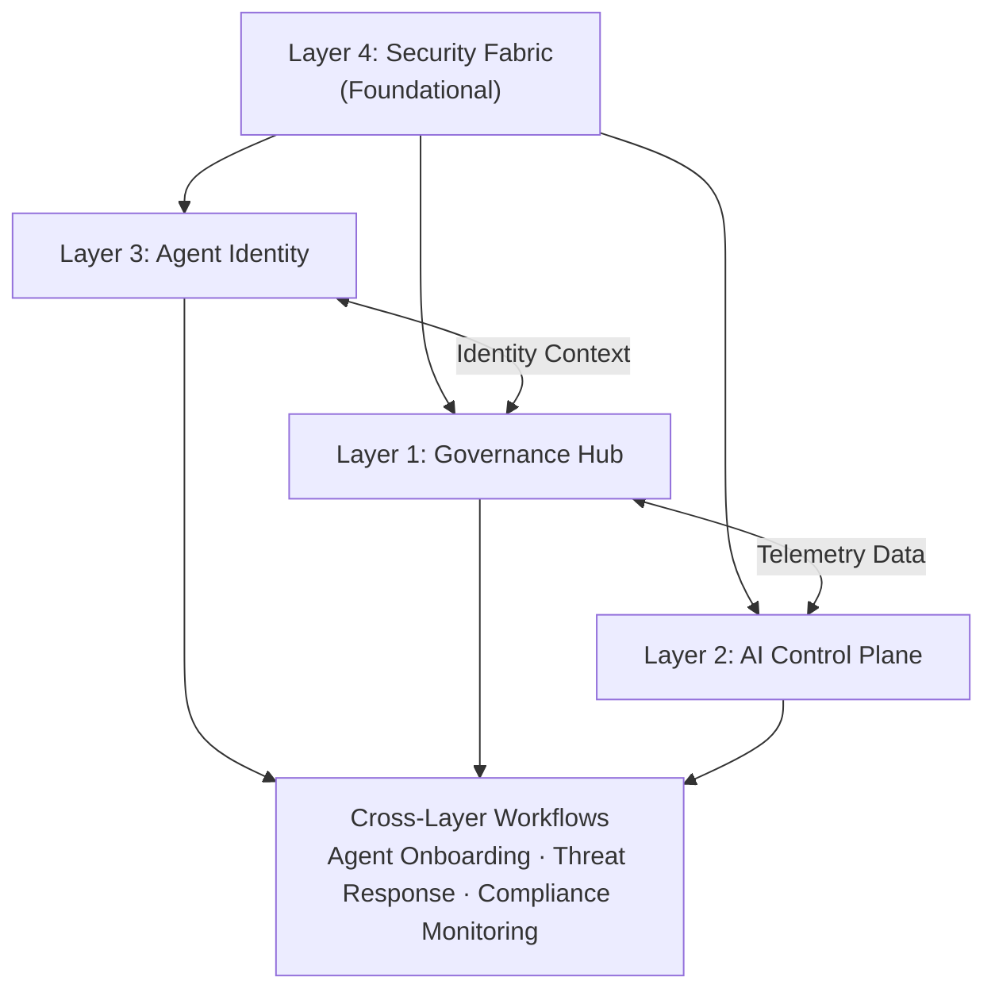

# 🔗 Layer Integration Guide

## Overview

The **Citadel 4-Layer Architecture** is not a collection of isolated silos—it is an **integrated system** where each layer contributes to comprehensive AI governance. This guide explains how layers interact, depend on each other, and work together to deliver end-to-end trust.

## Integration Philosophy

### Separation of Concerns with Unified Oversight

| Principle | Description |
|-----------|-------------|
| **Clear Boundaries** | Each layer owns specific responsibilities |
| **Defined Interfaces** | Layers communicate through well-defined contracts |
| **Bidirectional Flow** | Information flows up and down the stack |
| **Cross-Cutting Concerns** | Security and compliance span all layers |

## Inter-Layer Dependencies Matrix

### Dependency Overview

| Layer | Depends On | Provides To |
|-------|------------|-------------|
| **Layer 1 (Governance Hub)** | Layer 3 (Identity validation), Layer 4 (Threat intel) | Telemetry to Layer 2, enforcement for all |
| **Layer 2 (AI Control Plane)** | Layer 1 (Telemetry), Layer 3 (Identity context), Layer 4 (Security signals) | Compliance insights to all, evaluations to Layer 1 |
| **Layer 3 (Agent Identity)** | Layer 4 (Identity platform) | Identity context to Layers 1 & 2, lifecycle to all |
| **Layer 4 (Security Fabric)** | None (foundational) | Security signals to all layers |

### Detailed Dependency Mapping



## Layer 1 Integration Patterns

### Integration with Layer 2 (AI Control Plane)

| Direction | Data Flow | Purpose |
|-----------|-----------|---------|
| **L1 → L2** | Usage telemetry, request logs | Observability data for monitoring |
| **L1 → L2** | Policy enforcement events | Compliance tracking |
| **L2 → L1** | Evaluation results | Policy refinement feedback |
| **L2 → L1** | Compliance alerts | Gateway policy adjustments |

```
Example: Usage Tracking Flow

User Request → Gateway (L1) → Backend AI Service
                    │
                    ▼
            Telemetry Captured
                    │
                    ▼
            Control Plane (L2)
            • Usage Analytics
            • Cost Attribution
            • Compliance Check
```

### Integration with Layer 3 (Agent Identity)

| Direction | Data Flow | Purpose |
|-----------|-----------|---------|
| **L1 → L3** | Authentication requests | Identity validation |
| **L1 → L3** | Access token validation | Authorization checks |
| **L3 → L1** | Identity context | Policy decisions |
| **L3 → L1** | Lifecycle events | Access revocation |

```
Example: Agent Authentication Flow

Agent Request → Gateway (L1) → Validate Token
                              │
                              ▼
                      Entra ID (L3)
                      • Verify Identity
                      • Check Access Rights
                              │
                              ▼
                      Gateway Decision
                      • Allow/Deny
                      • Apply Rate Limits
```

### Integration with Layer 4 (Security Fabric)

| Direction | Data Flow | Purpose |
|-----------|-----------|---------|
| **L1 → L4** | Request/response content | Threat analysis |
| **L1 → L4** | Traffic patterns | Anomaly detection |
| **L4 → L1** | Threat intelligence | Real-time blocking |
| **L4 → L1** | Security policies | Gateway enforcement |

```
Example: Threat Protection Flow

Request → Gateway (L1) → Content Scan
                              │
                              ▼
                    Defender (L4)
                    • Jailbreak Detection
                    • Injection Analysis
                              │
                              ▼
                    Response Action
                    • Allow / Block / Alert
```

## Layer 2 Integration Patterns

### Integration with Layer 1 (Governance Hub)

The AI Control Plane relies on the Governance Hub as its primary data source:

| Dependency | Data Type | Usage |
|------------|-----------|-------|
| **Telemetry** | Request logs, response data | Usage analytics, cost tracking |
| **Policy Events** | Enforcement actions | Compliance monitoring |
| **Performance Metrics** | Latency, error rates | Platform health monitoring |

### Integration with Layer 3 (Agent Identity)

| Dependency | Data Type | Usage |
|------------|-----------|-------|
| **Identity Context** | Agent ID, sponsor info | Per-agent compliance tracking |
| **Lifecycle Events** | Activation, deactivation | Fleet operations |
| **Access History** | Permission changes | Audit trails |

### Integration with Layer 4 (Security Fabric)

| Dependency | Data Type | Usage |
|------------|-----------|-------|
| **Threat Signals** | Security alerts | Risk-based evaluations |
| **Compliance Data** | Policy violations | Compliance dashboards |
| **Identity Risks** | Anomalous access | Agent behavior analysis |

```
Example: Compliance Monitoring Flow

Gateway Events → Control Plane (L2)
                      │
                      ├───► Usage Analytics
                      │
                      ├───► Agent Evaluation
                      │         │
                      │         ▼
                      │   Security Signals (L4)
                      │         │
                      │         ▼
                      │   Risk Assessment
                      │
                      └───► Compliance Dashboard
```

## Layer 3 Integration Patterns

### Integration with Layer 1 (Governance Hub)

Agent Identity validates all access at the gateway:

| Dependency | Purpose |
|------------|---------|
| **Token Validation** | Verify agent identity on each request |
| **Access Enforcement** | Apply identity-based policies |
| **Lifecycle Integration** | Block retired or suspended agents |

### Integration with Layer 2 (AI Control Plane)

| Dependency | Purpose |
|------------|---------|
| **Identity Registration** | Foundry agents register with Agent 365 |
| **Behavior Tracking** | Link agent actions to identity |
| **Compliance Correlation** | Per-agent compliance status |

### Integration with Layer 4 (Security Fabric)

Agent 365 is built on the Security Fabric's identity foundation:

| Dependency | Purpose |
|------------|---------|
| **Entra ID Platform** | Core identity services |
| **Defender Signals** | Detect anomalous agent behavior |
| **Purview Policies** | Data governance for agent access |

## Layer 4 Integration Patterns

### Layer 4 as Foundational Service

Security Fabric provides foundational services to all layers:

```
Layer 4 Services:
├── Defender
│   ├── Threat Intel → All Layers
│   ├── Jailbreak Detection → Layer 1
│   └── Posture Management → All Layers
│
├── Purview
│   ├── Data Classification → All Layers
│   ├── PII Protection → Layer 1
│   └── Compliance Automation → Layer 2
│
└── Entra
    ├── Identity Services → Layer 3
    ├── Access Control → Layer 1
    └── Shadow Detection → All Layers
```

## Data Flow Between Layers

### Request Flow (Top to Bottom)

```
1. User/Agent Request
   ↓
2. Layer 4: Security Scan (Defender)
   ↓
3. Layer 3: Identity Validation (Entra)
   ↓
4. Layer 1: Policy Enforcement (Gateway)
   → Rate limiting, routing, safety checks
   ↓
5. Backend AI Service
   ↓
6. Layer 1: Response Processing
   → Content filtering, PII masking
   ↓
7. Response to User/Agent
```

### Observability Flow (Bottom to Top)

```
1. Request/Response Events (Layer 1)
   ↓
2. Telemetry Collection
   → Usage, performance, policy events
   ↓
3. Layer 2: Analysis
   → Analytics, evaluations, compliance checks
   ↓
4. Security Correlation (Layer 4)
   → Threat detection, anomaly analysis
   ↓
5. Unified Dashboards
   → Cross-layer visibility
```

### Compliance Flow (Circular)

```
1. Policy Definition (Layer 2)
   ↓
2. Policy Deployment (Layer 1)
   ↓
3. Policy Enforcement (Layer 1)
   ↓
4. Compliance Monitoring (Layer 2)
   ↓
5. Violation Alerts (Layer 4)
   ↓
6. Remediation (All Layers)
   ↓
[Back to 1]
```

## Shared Services and Cross-Layer Capabilities

### Cross-Cutting Concerns

| Capability | Spanning Layers | Implementation |
|------------|-----------------|----------------|
| **Authentication** | All | Entra ID tokens |
| **Audit Logging** | All | Centralized logging |
| **Monitoring** | All | Azure Monitor |
| **Policy Enforcement** | All | Azure Policy + Gateway |
| **Compliance** | All | Purview + Control Plane |

### Shared Infrastructure

| Component | Layers Using | Purpose |
|-----------|--------------|---------|
| **Azure Monitor** | All | Unified telemetry |
| **Log Analytics** | All | Centralized logging |
| **Key Vault** | 1, 3, 4 | Secret management |
| **Entra ID** | 1, 3, 4 | Identity services |

## Integration APIs and Protocols

### Inter-Layer Communication

| Protocol | Use Case | Layers |
|----------|----------|--------|
| **REST API** | Configuration, management | All |
| **Event Grid** | Event-driven notifications | All |
| **Service Bus** | Reliable messaging | 1, 2 |
| **Log Streaming** | Telemetry flow | 1 → 2 |

### Authentication Between Layers

| Method | Purpose |
|--------|---------|
| **Managed Identities** | Service-to-service auth |
| **Service Principals** | Cross-service access |
| **Token Exchange** | Delegated access |

## Best Practices for Layer Integration

### 1. Design for Independence

- Each layer should function independently if others are unavailable
- Graceful degradation when dependencies fail
- Clear service level agreements between layers

### 2. Minimize Coupling

- Use well-defined APIs and contracts
- Avoid direct database access between layers
- Event-driven communication where possible

### 3. Ensure Observability

- Monitor integration points for failures
- Track cross-layer latency
- Alert on integration health

### 4. Maintain Security Boundaries

- Authenticate all inter-layer communication
- Apply least privilege for layer-to-layer access
- Audit cross-layer operations

## Troubleshooting Integration Issues

### Common Issues

| Symptom | Possible Cause | Resolution |
|---------|----------------|------------|
| Authentication failures | Token expiration | Check Entra ID sync |
| Missing telemetry | Log streaming failure | Verify Event Hub connectivity |
| Policy not enforced | Sync delay | Check policy propagation |
| Compliance gaps | Integration failure | Review Control Plane connectivity |

### Diagnostic Commands

```bash
# Check gateway connectivity
az apim show -n $APIM_NAME -g $RG

# Verify identity integration
az ad sp show --id $AGENT_ID

# Check monitoring data flow
az monitor log-analytics query \
  --workspace $WORKSPACE_ID \
  --analytics-query "Heartbeat | where TimeGenerated > ago(1h)"
```

## Summary

The Citadel 4-Layer Architecture achieves comprehensive AI governance through **tight integration** while maintaining **clear separation of concerns**. Each layer:

- **Contributes unique capabilities** to the overall governance posture
- **Consumes services** from supporting layers
- **Provides services** to consuming layers
- **Integrates with the Security Fabric** for unified protection

This integration pattern enables:
- ✅ **Modular evolution** — Update layers independently
- ✅ **Resilient operations** — Graceful degradation on failures
- ✅ **Unified visibility** — Cross-layer observability
- ✅ **Comprehensive security** — Defense in depth

## Next Steps

- Review [deployment guides](/getting-started/quick-start) to implement the architecture
- Explore [networking patterns](/guides/ai-landing-zone/network-approach) for layer connectivity
- Learn about [operations](/guides/citadel-hub/operations/usage-analytics) for managing integrated layers
