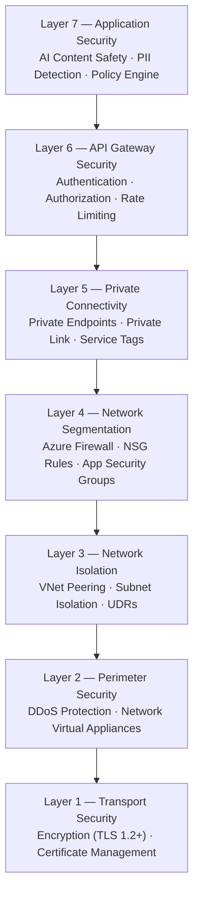
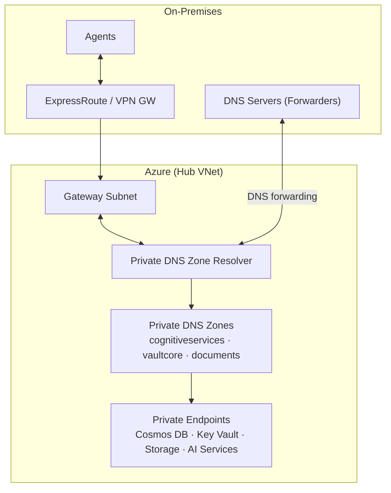

# Network Security

Citadel Governance Hub implements a defense-in-depth security model for network protection. This document covers all security layers from network perimeter to individual service access.

## Defense in Depth Strategy



## Network Security Groups (NSGs)

### Default NSG Rules

Every subnet should have an NSG with default deny rules:

```bicep
resource defaultNsg 'Microsoft.Network/networkSecurityGroups@2023-11-01' = {
  name: 'nsg-default-deny'
  location: location
  properties: {
    securityRules: [
      {
        name: 'DenyAllInbound'
        properties: {
          priority: 4096
          direction: 'Inbound'
          access: 'Deny'
          protocol: '*'
          sourcePortRange: '*'
          destinationPortRange: '*'
          sourceAddressPrefix: '*'
          destinationAddressPrefix: '*'
          description: 'Default deny all inbound traffic'
        }
      }
      {
        name: 'DenyAllOutbound'
        properties: {
          priority: 4096
          direction: 'Outbound'
          access: 'Deny'
          protocol: '*'
          sourcePortRange: '*'
          destinationPortRange: '*'
          sourceAddressPrefix: '*'
          destinationAddressPrefix: '*'
          description: 'Default deny all outbound traffic'
        }
      }
    ]
  }
}
```

### APIM Subnet NSG Rules

For API Management VNet injection (Developer/Premium SKU):

| Direction | Priority | Name | Port | Source | Destination | Purpose |
|-----------|----------|------|------|--------|-------------|---------|
| Inbound | 100 | AllowHTTPS | 443 | VirtualNetwork | VirtualNetwork | Internal HTTPS |
| Inbound | 110 | AllowAPIManagement | 3443 | ApiManagement | VirtualNetwork | Management plane |
| Inbound | 120 | AllowLoadBalancer | 6390 | AzureLoadBalancer | VirtualNetwork | Health probes |
| Inbound | 130 | AllowAzureTrafficManager | 443 | AzureTrafficManager | VirtualNetwork | Traffic routing |
| Outbound | 100 | AllowStorage | 443 | VirtualNetwork | Storage | Blob/Queue/Table |
| Outbound | 110 | AllowSQL | 1433 | VirtualNetwork | SQL | Metadata DB |
| Outbound | 120 | AllowKeyVault | 443 | VirtualNetwork | AzureKeyVault | Secrets |
| Outbound | 130 | AllowMonitor | 1886,443 | VirtualNetwork | AzureMonitor | Diagnostics |
| Outbound | 140 | AllowEventHub | 5671,5672 | VirtualNetwork | EventHub | Logging |
| Outbound | 150 | AllowServiceBus | 9350-9354 | VirtualNetwork | ServiceBus | Messaging |

### CGH Services Subnet NSG

```bicep
resource nsgCghServices 'Microsoft.Network/networkSecurityGroups@2023-11-01' = {
  name: 'nsg-citadel-hub-services'
  location: location
  properties: {
    securityRules: [
      {
        name: 'AllowHubVNetInbound'
        properties: {
          priority: 100
          direction: 'Inbound'
          access: 'Allow'
          protocol: 'Tcp'
          sourcePortRange: '*'
          destinationPortRange: '443'
          sourceAddressPrefix: 'VirtualNetwork'
          destinationAddressPrefix: 'VirtualNetwork'
        }
      }
      {
        name: 'AllowSpokePeeringInbound'
        properties: {
          priority: 110
          direction: 'Inbound'
          access: 'Allow'
          protocol: 'Tcp'
          sourcePortRange: '*'
          destinationPortRange: '443'
          sourceAddressPrefixes: [
            '10.171.0.0/22'  // Agent Spoke
            '10.172.0.0/22'  // Dev Spoke
          ]
          destinationAddressPrefix: 'VirtualNetwork'
        }
      }
      {
        name: 'AllowAzureMonitorOutbound'
        properties: {
          priority: 100
          direction: 'Outbound'
          access: 'Allow'
          protocol: 'Tcp'
          sourcePortRange: '*'
          destinationPortRanges: [
            '443'
            '1886'
          ]
          sourceAddressPrefix: 'VirtualNetwork'
          destinationAddressPrefix: 'AzureMonitor'
        }
      }
    ]
  }
}
```

### Application Security Groups (ASGs)

Use ASGs for micro-segmentation:

```bicep
// Define ASGs
resource asgApiGateway 'Microsoft.Network/applicationSecurityGroups@2023-11-01' = {
  name: 'asg-api-gateway'
  location: location
}

resource asgAiWorkloads 'Microsoft.Network/applicationSecurityGroups@2023-11-01' = {
  name: 'asg-ai-workloads'
  location: location
}

resource asgDataServices 'Microsoft.Network/applicationSecurityGroups@2023-11-01' = {
  name: 'asg-data-services'
  location: location
}

// Reference ASGs in NSG rules
{
  name: 'AllowWorkloadsToGateway'
  properties: {
    priority: 100
    direction: 'Inbound'
    access: 'Allow'
    protocol: 'Tcp'
    sourcePortRange: '*'
    destinationPortRange: '443'
    sourceApplicationSecurityGroups: [
      { id: asgAiWorkloads.id }
    ]
    destinationApplicationSecurityGroups: [
      { id: asgApiGateway.id }
    ]
  }
}
```

## Azure Firewall Integration

### Firewall Configuration

```bicep
resource firewall 'Microsoft.Network/azureFirewalls@2023-11-01' = {
  name: 'afw-citadel-hub'
  location: location
  properties: {
    sku: {
      name: 'AZFW_VNet'
      tier: 'Standard'  // or 'Premium' for TLS inspection
    }
    ipConfigurations: [
      {
        name: 'IpConf1'
        properties: {
          subnet: {
            id: resourceId('Microsoft.Network/virtualNetworks/subnets', hubVnet.name, 'AzureFirewallSubnet')
          }
          publicIPAddress: {
            id: firewallPublicIp.id
          }
        }
      }
    ]
    applicationRuleCollections: [
      {
        name: 'AI-Allowed-Endpoints'
        properties: {
          priority: 100
          action: {
            type: 'Allow'
          }
          rules: [
            {
              name: 'Allow-OpenAI'
              protocols: [
                { port: 443, protocolType: 'Https' }
              ]
              targetFqdns: [
                '*.openai.azure.com'
                '*.cognitiveservices.azure.com'
              ]
              sourceAddresses: [
                '10.170.0.0/22'  // CGH
                '10.171.0.0/22'  // Spokes
              ]
            }
            {
              name: 'Allow-AzureServices'
              protocols: [
                { port: 443, protocolType: 'Https' }
              ]
              targetFqdns: [
                '*.azurewebsites.net'
                '*.azurecr.io'
                '*.vault.azure.net'
              ]
              sourceAddresses: [
                'VirtualNetwork'
              ]
            }
          ]
        }
      }
    ]
    networkRuleCollections: [
      {
        name: 'AI-Network-Rules'
        properties: {
          priority: 100
          action: {
            type: 'Allow'
          }
          rules: [
            {
              name: 'Allow-HTTPS-Internal'
              protocols: [
                'TCP'
              ]
              sourceAddresses: [
                '10.170.0.0/22'
                '10.171.0.0/22'
              ]
              destinationAddresses: [
                'VirtualNetwork'
              ]
              destinationPorts: [
                '443'
              ]
            }
          ]
        }
      }
    ]
    threatIntelMode: 'Alert'  // or 'Deny' for strict mode
  }
}
```

### Firewall Rules for AI Workloads

| Category | Rule | Purpose |
|----------|------|---------|
| **Allow** | Azure OpenAI Endpoints | LLM API access |
| **Allow** | Azure AI Services | Cognitive services |
| **Allow** | Azure Monitor | Logging and metrics |
| **Allow** | Azure Container Registry | Image pulls |
| **Deny** | High-Risk Countries | Geo-blocking |
| **Deny** | Known Malicious IPs | Threat intelligence |
| **Deny** | Non-HTTPS Traffic | Encryption enforcement |

### Threat Intelligence

Enable threat intelligence-based filtering:

```bicep
resource firewallPolicy 'Microsoft.Network/firewallPolicies@2023-11-01' = {
  name: 'afwp-citadel-hub'
  location: location
  properties: {
    threatIntelMode: 'Deny'  // Alert, Deny, or Off
    threatIntelWhitelist: {
      fqdns: [
        'trusted-third-party.ai'  // Whitelist legitimate AI services
      ]
      ipAddresses: [
        '203.0.113.0/24'  // Whitelist partner networks
      ]
    }
  }
}
```

## Private Endpoints and Private Link

### Service-Specific Private Endpoints

| Service | Private Endpoint | DNS Zone |
|---------|-----------------|----------|
| Azure OpenAI | `privatelink.openai.azure.com` | `privatelink.cognitiveservices.azure.com` |
| Azure AI Services | `privatelink.cognitiveservices.azure.com` | `privatelink.cognitiveservices.azure.com` |
| Key Vault | `privatelink.vaultcore.azure.net` | `privatelink.vaultcore.azure.net` |
| Cosmos DB | `privatelink.documents.azure.com` | `privatelink.documents.azure.com` |
| Storage Blob | `privatelink.blob.core.windows.net` | `privatelink.blob.core.windows.net` |
| Event Hub | `privatelink.servicebus.windows.net` | `privatelink.servicebus.windows.net` |
| Monitor | `privatelink.monitor.azure.com` | `privatelink.monitor.azure.com` |
| API Management | `privatelink.azure-api.net` | `privatelink.azure-api.net` |
| AI Foundry | `privatelink.services.ai.azure.com` | `privatelink.services.ai.azure.com` |

### Private Endpoint Configuration

```bicep
resource privateEndpoint 'Microsoft.Network/privateEndpoints@2023-11-01' = {
  name: 'pe-cosmosdb-citadel'
  location: location
  properties: {
    subnet: {
      id: resourceId('Microsoft.Network/virtualNetworks/subnets', vnet.name, 'snet-private-endpoints')
    }
    privateLinkServiceConnections: [
      {
        name: 'cosmosdb-connection'
        properties: {
          privateLinkServiceId: cosmosDbAccount.id
          groupIds: [
            'Sql'
          ]
        }
      }
    ]
  }
}

// DNS Zone Group for automatic DNS registration
resource privateDnsZoneGroup 'Microsoft.Network/privateEndpoints/privateDnsZoneGroups@2023-11-01' = {
  name: 'default'
  parent: privateEndpoint
  properties: {
    privateDnsZoneConfigs: [
      {
        name: 'cosmosdb-config'
        properties: {
          privateDnsZoneId: resourceId('Microsoft.Network/privateDnsZones', 'privatelink.documents.azure.com')
        }
      }
    ]
  }
}
```

### On-Premises Connectivity

For hybrid scenarios with on-premises connectivity:



## DDoS Protection

### DDoS Protection Standard

Enable Azure DDoS Protection Standard for public endpoints:

```bicep
resource ddosProtectionPlan 'Microsoft.Network/ddosProtectionPlans@2023-11-01' = {
  name: 'ddos-citadel-hub'
  location: location
}

resource vnetWithDdos 'Microsoft.Network/virtualNetworks@2023-11-01' = {
  name: 'vnet-citadel-hub'
  location: location
  properties: {
    addressSpace: {
      addressPrefixes: [
        '10.170.0.0/22'
      ]
    }
    ddosProtectionPlan: {
      id: ddosProtectionPlan.id
    }
    enableDdosProtection: true
  }
}
```

### Protection Policies

| Protection Type | Coverage |
|-----------------|----------|
| **Volumetric Attacks** | Layer 3/4 flood protection |
| **Protocol Attacks** | TCP/UDP anomaly detection |
| **Resource Attacks** | Layer 7 application protection |
| **AI-Specific** | API rate anomaly detection |

## Network Monitoring and Logging

### NSG Flow Logs

Enable NSG flow logging for traffic analysis:

```bicep
resource nsgFlowLogs 'Microsoft.Network/networkWatchers/flowLogs@2023-11-01' = {
  name: 'nsg-flowlogs-citadel-hub'
  parent: networkWatcher
  location: location
  properties: {
    targetResourceId: nsgCghServices.id
    storageId: storageAccount.id
    enabled: true
    retentionPolicy: {
      enabled: true
      days: 30
    }
    format: {
      type: 'JSON'
      version: 2
    }
  }
}
```

### Azure Firewall Logs

Enable comprehensive firewall logging:

```bicep
resource firewallDiagnostics 'Microsoft.Insights/diagnosticSettings@2021-05-01-preview' = {
  name: 'firewall-diagnostics'
  scope: firewall
  properties: {
    logs: [
      {
        category: 'AzureFirewallApplicationRule'
        enabled: true
        retentionPolicy: {
          enabled: true
          days: 30
        }
      }
      {
        category: 'AzureFirewallNetworkRule'
        enabled: true
        retentionPolicy: {
          enabled: true
          days: 30
        }
      }
      {
        category: 'AzureFirewallDnsProxy'
        enabled: true
        retentionPolicy: {
          enabled: true
          days: 30
        }
      }
    ]
    metrics: [
      {
        category: 'AllMetrics'
        enabled: true
        retentionPolicy: {
          enabled: true
          days: 30
        }
      }
    ]
    workspaceId: logAnalyticsWorkspace.id
  }
}
```

### Traffic Analytics

Enable Traffic Analytics for network insights:

```bicep
resource trafficAnalytics 'Microsoft.Network/networkWatchers/flowLogs@2023-11-01' = {
  name: 'traffic-analytics-citadel'
  parent: networkWatcher
  location: location
  properties: {
    targetResourceId: nsgCghServices.id
    storageId: storageAccount.id
    enabled: true
    retentionPolicy: {
      enabled: true
      days: 10
    }
    format: {
      type: 'JSON'
      version: 2
    }
    flowAnalyticsConfiguration: {
      networkWatcherFlowAnalyticsConfiguration: {
        enabled: true
        workspaceId: logAnalyticsWorkspace.properties.customerId
        trafficAnalyticsInterval: 60
      }
    }
  }
}
```

### Security Monitoring Queries

**Detect Suspicious AI API Access:**
```kusto
AzureDiagnostics
| where Category == "AzureFirewallApplicationRule"
| where msg_s contains "openai" or msg_s contains "cognitiveservices"
| where action_s == "Deny"
| summarize DeniedRequests = count() by SourceIP = srcip_s, FQDN = fqdn_s, bin(TimeGenerated, 5m)
| where DeniedRequests > 10
| project TimeGenerated, SourceIP, FQDN, DeniedRequests
```

**Identify Unusual Traffic Patterns:**
```kusto
AzureDiagnostics
| where Category == "AzureFirewallNetworkRule"
| where action_s == "Allow"
| summarize TotalBytes = sum(toint(bytesTransferredD)), ConnectionCount = count() by SourceIP = srcip_s, DestIP = dstip_s, bin(TimeGenerated, 1h)
| where TotalBytes > 104857600  // 100 MB threshold
| project TimeGenerated, SourceIP, DestIP, TotalBytes, ConnectionCount
| order by TotalBytes desc
```

## Security Best Practices

### Network Segmentation Checklist

- [ ] Default deny all traffic (inbound and outbound)
- [ ] Explicit allow rules only for required traffic
- [ ] Use ASGs for workload-based segmentation
- [ ] Separate subnets by function (gateway, data, management)
- [ ] Enable NSG flow logs on all subnets
- [ ] Regular NSG rule review and cleanup

### Private Connectivity Checklist

- [ ] All PaaS services use private endpoints
- [ ] Private DNS zones linked to all VNets
- [ ] No public endpoints for sensitive services
- [ ] Service endpoints where private endpoints not available
- [ ] On-premises DNS forwarding configured for hybrid

### Firewall Configuration Checklist

- [ ] Threat intelligence enabled (Alert or Deny mode)
- [ ] Application rules for HTTPS only
- [ ] Network rules for required protocols only
- [ ] FQDN filtering for outbound traffic
- [ ] Geo-blocking for high-risk countries
- [ ] Custom rules for AI-specific endpoints

### Monitoring Checklist

- [ ] NSG flow logs enabled
- [ ] Firewall logs sent to Log Analytics
- [ ] Traffic Analytics enabled
- [ ] Alert rules for suspicious patterns
- [ ] Regular log analysis and review

## Next Steps

<CardGroup>
  <Card title="VNet Peering" href="/architecture/vnet-peering" icon="link">
    Configure secure connectivity between hub and spokes
  </Card>
  <Card title="Network Topology" href="/architecture/network-topology" icon="network-wired">
    Review VNet and subnet design specifications
  </Card>
  <Card title="Deployment Patterns" href="/architecture/deployment-patterns" icon="server">
    Choose the right network deployment pattern
  </Card>
  <Card title="Network Approach Guide" href="/guides/network-approach" icon="book">
    Implementation guidance and troubleshooting
  </Card>
</CardGroup>
