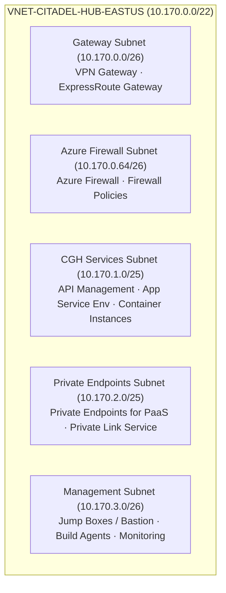
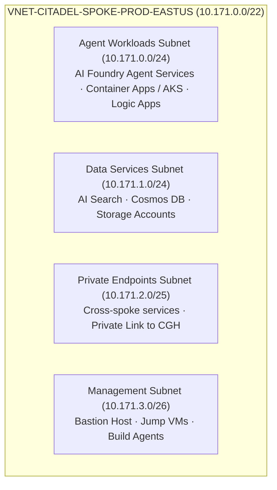
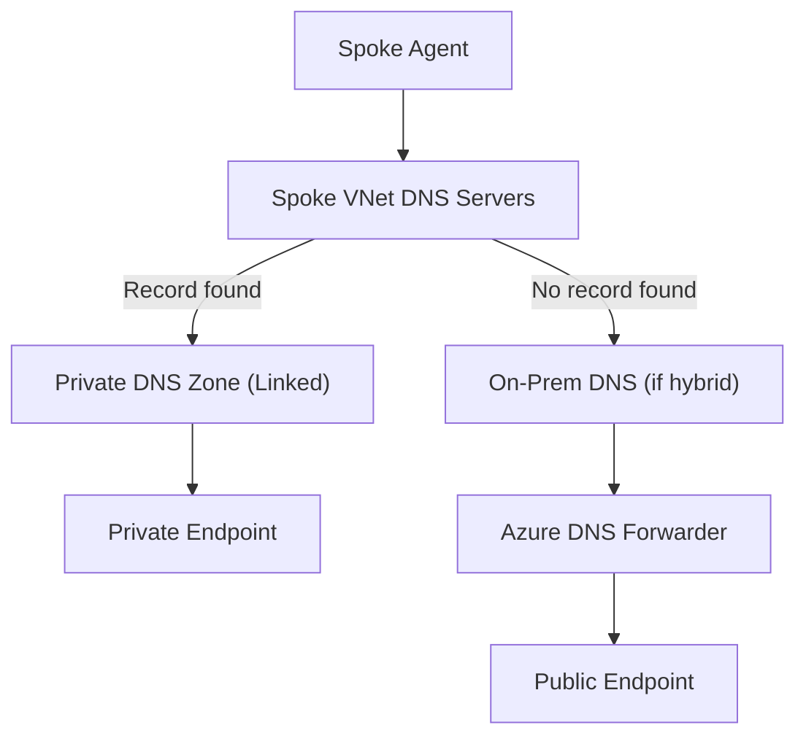
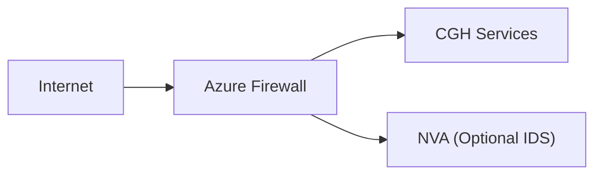

# Network Topology

This guide provides detailed network topology design for the Citadel Governance Hub and connected Agent Spokes, including VNet structure, subnet sizing, IP addressing, and private endpoint placement.

## Hub VNet Architecture

### CGH VNet Structure

The Central Governance Hub requires a dedicated virtual network with carefully planned subnets:



### Hub Subnet Sizing Guidelines

| Subnet | Size | Rationale |
|--------|------|-----------|
| **GatewaySubnet** | /26 | Minimum for VPN/ExpressRoute gateway (requires /27+) |
| **AzureFirewallSubnet** | /26 | Azure Firewall requires minimum /26 |
| **CGH Services** | /25 | APIM with VNet injection, plus headroom |
| **Private Endpoints** | /25 | One IP per service (Cosmos, Key Vault, Storage, etc.) |
| **Management** | /26 | Jump boxes, build agents, monitoring |

<Tip>
  Total address space: **/22** (1,024 IPs) provides sufficient headroom for growth while keeping broadcast domains manageable.
</Tip>

## Spoke VNet Architecture

### CAS VNet Structure

Each Agent Spoke follows a consistent pattern with dedicated subnets for workloads:



### Spoke Subnet Sizing Guidelines

| Subnet | Size | Rationale |
|--------|------|-----------|
| **Agent Workloads** | /24 | 256 IPs for Container Apps, AKS pods, Functions |
| **Data Services** | /24 | AI Search, Cosmos, Storage private endpoints |
| **Private Endpoints** | /25 | Private endpoints for CGH services |
| **Management** | /26 | Jump boxes, build agents |

## IP Addressing Reference Schema

### Recommended Address Ranges

| Network | Address Space | Purpose |
|---------|---------------|---------|
| **CGH-Hub** | 10.170.0.0/22 | Central Governance Hub |
| **CAS-Prod** | 10.171.0.0/22 | Production Agent Spoke |
| **CAS-Dev** | 10.172.0.0/22 | Development Agent Spoke |
| **CAS-Staging** | 10.173.0.0/22 | Staging Agent Spoke |
| **CAS-Finance** | 10.174.0.0/22 | Finance BU Spoke |
| **CAS-HR** | 10.175.0.0/22 | HR BU Spoke |
| **CAS-Legal** | 10.176.0.0/22 | Legal BU Spoke |

<Warning>
  Ensure no overlap with existing enterprise networks. Use Azure IPAM or network watcher to verify address space availability.
</Warning>

### Per-Region Expansion Pattern

When expanding to multiple regions, maintain consistent addressing:

| Region | CGH Hub | CAS Prod |
|--------|---------|----------|
| **East US** | 10.170.0.0/22 | 10.171.0.0/22 |
| **West US 2** | 10.180.0.0/22 | 10.181.0.0/22 |
| **West Europe** | 10.190.0.0/22 | 10.191.0.0/22 |

## Private Endpoint Placement

### CGH Private Endpoints

| Service | Subnet | DNS Zone | Notes |
|---------|--------|----------|-------|
| **Cosmos DB** | Private Endpoints | privatelink.documents.azure.com | Global distribution support |
| **Key Vault** | Private Endpoints | privatelink.vaultcore.azure.net | All secrets access |
| **Storage (Blob)** | Private Endpoints | privatelink.blob.core.windows.net | Usage data storage |
| **Storage (File)** | Private Endpoints | privatelink.file.core.windows.net | Configuration shares |
| **Storage (Queue)** | Private Endpoints | privatelink.queue.core.windows.net | Async processing |
| **Storage (Table)** | Private Endpoints | privatelink.table.core.windows.net | Metadata storage |
| **Event Hub** | Private Endpoints | privatelink.servicebus.windows.net | Usage streaming |
| **Monitor** | Private Endpoints | privatelink.monitor.azure.com | Log ingestion |
| **APIM (V2)** | Private Endpoints | privatelink.azure-api.net | Gateway access |
| **AI Services** | Private Endpoints | privatelink.cognitiveservices.azure.com | LLM access |
| **AI Foundry** | Private Endpoints | privatelink.services.ai.azure.com | Foundry services |

### CAS Private Endpoints

| Service | Subnet | DNS Zone | Notes |
|---------|--------|----------|-------|
| **AI Search** | Private Endpoints | privatelink.search.windows.net | Vector search |
| **Cosmos DB** | Private Endpoints | privatelink.documents.azure.com | Agent state |
| **Storage** | Private Endpoints | Multiple | Documents, models |
| **Container Registry** | Private Endpoints | privatelink.azurecr.io | Image pulls |
| **Key Vault** | Private Endpoints | privatelink.vaultcore.azure.net | Spoke secrets |

## DNS Architecture

### Private DNS Zones

Required private DNS zones for Citadel deployments:

```bicep
param existingPrivateDnsZones = {
  // AI Services
  cognitiveServices: '/subscriptions/{sub}/resourceGroups/{rg}/providers/Microsoft.Network/privateDnsZones/privatelink.cognitiveservices.azure.com'
  aiServices: '/subscriptions/{sub}/resourceGroups/{rg}/providers/Microsoft.Network/privateDnsZones/privatelink.services.ai.azure.com'
  aiSearch: '/subscriptions/{sub}/resourceGroups/{rg}/providers/Microsoft.Network/privateDnsZones/privatelink.search.windows.net'
  
  // Storage
  storageBlob: '/subscriptions/{sub}/resourceGroups/{rg}/providers/Microsoft.Network/privateDnsZones/privatelink.blob.core.windows.net'
  storageFile: '/subscriptions/{sub}/resourceGroups/{rg}/providers/Microsoft.Network/privateDnsZones/privatelink.file.core.windows.net'
  storageTable: '/subscriptions/{sub}/resourceGroups/{rg}/providers/Microsoft.Network/privateDnsZones/privatelink.table.core.windows.net'
  storageQueue: '/subscriptions/{sub}/resourceGroups/{rg}/providers/Microsoft.Network/privateDnsZones/privatelink.queue.core.windows.net'
  
  // Database & Cache
  cosmosDb: '/subscriptions/{sub}/resourceGroups/{rg}/providers/Microsoft.Network/privateDnsZones/privatelink.documents.azure.com'
  redis: '/subscriptions/{sub}/resourceGroups/{rg}/providers/Microsoft.Network/privateDnsZones/privatelink.redis.cache.windows.net'
  
  // Messaging
  eventHub: '/subscriptions/{sub}/resourceGroups/{rg}/providers/Microsoft.Network/privateDnsZones/privatelink.servicebus.windows.net'
  
  // Security & Config
  keyVault: '/subscriptions/{sub}/resourceGroups/{rg}/providers/Microsoft.Network/privateDnsZones/privatelink.vaultcore.azure.net'
  appConfig: '/subscriptions/{sub}/resourceGroups/{rg}/providers/Microsoft.Network/privateDnsZones/privatelink.azconfig.io'
  
  // Container & Compute
  containerRegistry: '/subscriptions/{sub}/resourceGroups/{rg}/providers/Microsoft.Network/privateDnsZones/privatelink.azurecr.io'
  
  // Monitoring
  monitor: '/subscriptions/{sub}/resourceGroups/{rg}/providers/Microsoft.Network/privateDnsZones/privatelink.monitor.azure.com'
  
  // API Management
  apimGateway: '/subscriptions/{sub}/resourceGroups/{rg}/providers/Microsoft.Network/privateDnsZones/privatelink.azure-api.net'
}
```

### DNS Resolution Flow



## Network Virtual Appliances

### When to Use NVAs

| Scenario | Recommendation | Example |
|----------|---------------|---------|
| **Advanced firewalling** | Azure Firewall + NVA | Palo Alto, Fortinet |
| **Custom routing** | Virtual appliance | F5, Citrix ADC |
| **Intrusion detection** | IDS/IPS appliance | Darktrace, ExtraHop |
| **WAF requirements** | Application Gateway + NVA | F5 WAF, Imperva |

### NVA Placement



## Configuration Examples

### Bicep: Hub VNet with Subnets

```bicep
resource hubVnet 'Microsoft.Network/virtualNetworks@2023-11-01' = {
  name: 'vnet-citadel-hub-${location}'
  location: location
  properties: {
    addressSpace: {
      addressPrefixes: [
        '10.170.0.0/22'
      ]
    }
    subnets: [
      {
        name: 'GatewaySubnet'
        properties: {
          addressPrefix: '10.170.0.0/26'
        }
      }
      {
        name: 'AzureFirewallSubnet'
        properties: {
          addressPrefix: '10.170.0.64/26'
        }
      }
      {
        name: 'snet-citadel-services'
        properties: {
          addressPrefix: '10.170.1.0/25'
          networkSecurityGroup: {
            id: nsgCghServices.id
          }
          routeTable: {
            id: rtCghServices.id
          }
          serviceEndpoints: [
            {
              service: 'Microsoft.Storage'
            }
            {
              service: 'Microsoft.KeyVault'
            }
          ]
        }
      }
      {
        name: 'snet-citadel-private-endpoints'
        properties: {
          addressPrefix: '10.170.2.0/25'
          privateEndpointNetworkPolicies: 'Disabled'
          privateLinkServiceNetworkPolicies: 'Enabled'
        }
      }
      {
        name: 'snet-citadel-management'
        properties: {
          addressPrefix: '10.170.3.0/26'
          networkSecurityGroup: {
            id: nsgManagement.id
          }
        }
      }
    ]
  }
}
```

### Bicep: Spoke VNet with Subnets

```bicep
resource spokeVnet 'Microsoft.Network/virtualNetworks@2023-11-01' = {
  name: 'vnet-citadel-spoke-${spokeName}-${location}'
  location: location
  properties: {
    addressSpace: {
      addressPrefixes: [
        '10.171.0.0/22'
      ]
    }
    subnets: [
      {
        name: 'snet-agent-workloads'
        properties: {
          addressPrefix: '10.171.0.0/24'
          delegations: [
            {
              name: 'Microsoft.Web/serverFarms'
              properties: {
                serviceName: 'Microsoft.Web/serverFarms'
              }
            }
          ]
        }
      }
      {
        name: 'snet-data-services'
        properties: {
          addressPrefix: '10.171.1.0/24'
        }
      }
      {
        name: 'snet-private-endpoints'
        properties: {
          addressPrefix: '10.171.2.0/25'
          privateEndpointNetworkPolicies: 'Disabled'
        }
      }
      {
        name: 'snet-management'
        properties: {
          addressPrefix: '10.171.3.0/26'
        }
      }
    ]
  }
}
```

## Next Steps

<CardGroup>
  <Card title="Deployment Patterns" href="/architecture/deployment-patterns" icon="server">
    Choose between hub-network and spoke-network deployment approaches
  </Card>
  <Card title="Network Security" href="/architecture/network-security" icon="shield">
    Implement NSGs, Azure Firewall, and security controls
  </Card>
  <Card title="VNet Peering" href="/architecture/vnet-peering" icon="link">
    Configure peering and routing between hub and spokes
  </Card>
  <Card title="Network Approach Guide" href="/guides/network-approach" icon="book">
    Step-by-step implementation guidance
  </Card>
</CardGroup>
