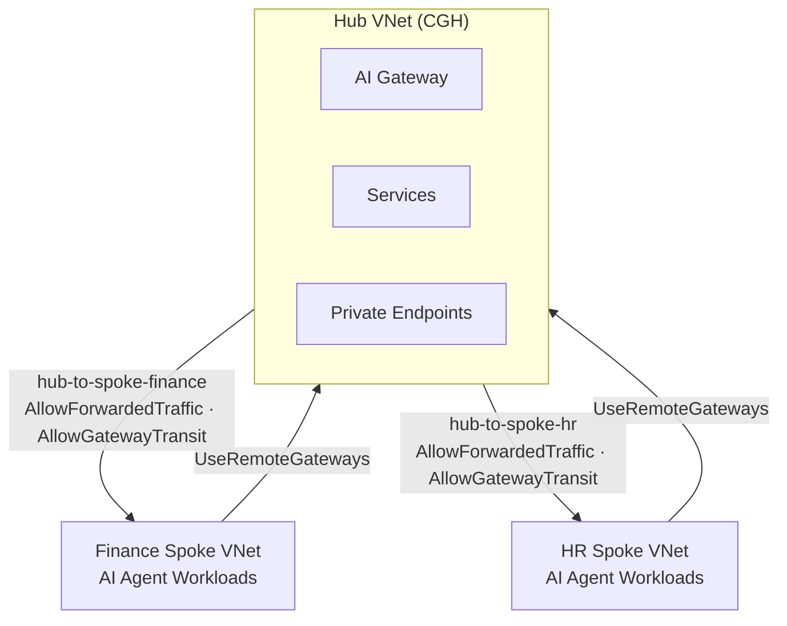
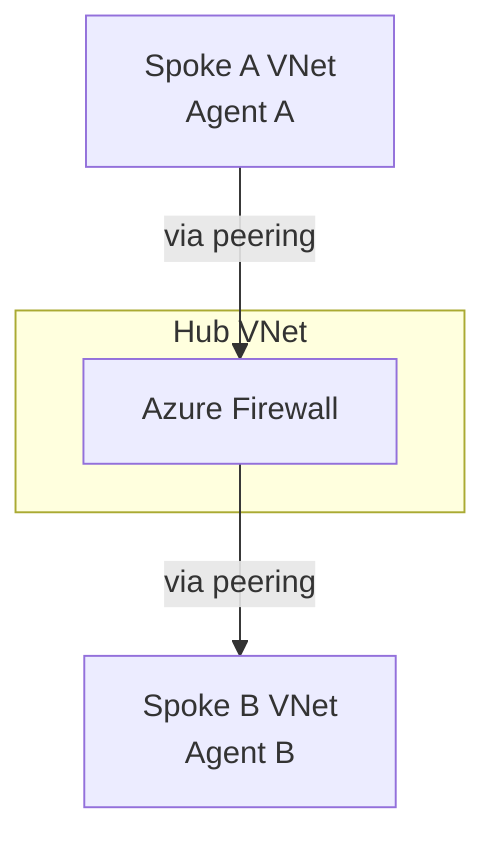
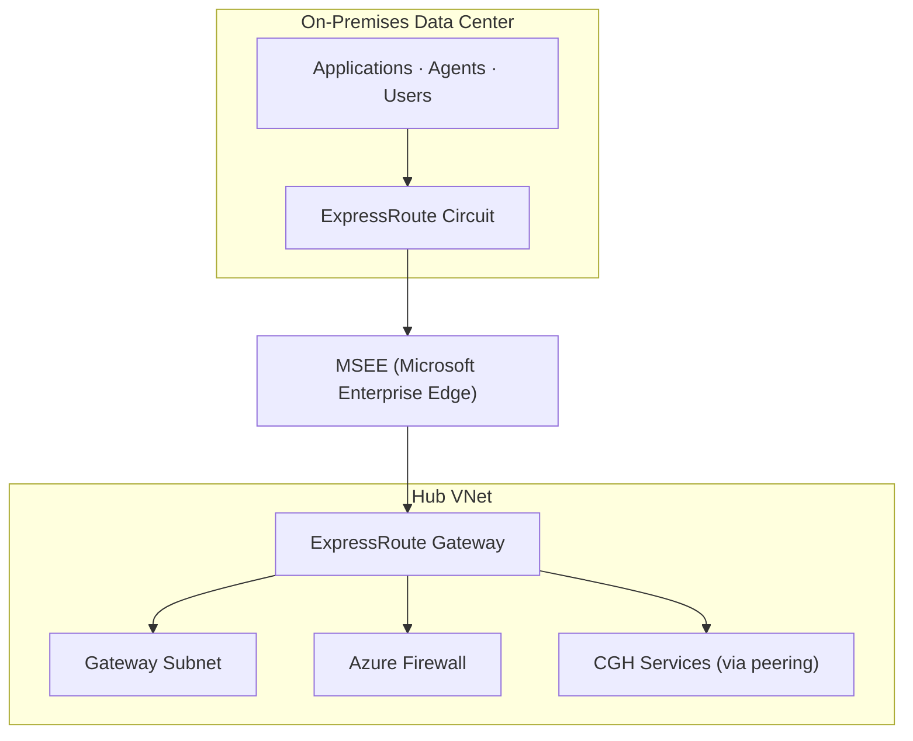

# VNet Peering and Connectivity

This document covers VNet peering patterns, routing configuration, and connectivity options for Citadel Governance Hub hub-spoke architecture.

## Hub-Spoke Peering Configuration

### Basic Peering Model



### Peering Configuration (Bicep)

```bicep
// Hub to Spoke Peering
resource hubToSpokePeering 'Microsoft.Network/virtualNetworks/virtualNetworkPeerings@2023-11-01' = {
  name: 'hub-to-spoke-${spokeName}'
  parent: hubVnet
  properties: {
    remoteVirtualNetwork: {
      id: spokeVnet.id
    }
    allowVirtualNetworkAccess: true
    allowForwardedTraffic: true
    allowGatewayTransit: true
    useRemoteGateways: false
  }
}

// Spoke to Hub Peering
resource spokeToHubPeering 'Microsoft.Network/virtualNetworks/virtualNetworkPeerings@2023-11-01' = {
  name: 'spoke-${spokeName}-to-hub'
  parent: spokeVnet
  properties: {
    remoteVirtualNetwork: {
      id: hubVnet.id
    }
    allowVirtualNetworkAccess: true
    allowForwardedTraffic: true
    allowGatewayTransit: false
    useRemoteGateways: true
  }
}
```

### Gateway Transit Settings

| Peering Direction | AllowGatewayTransit | UseRemoteGateways | Purpose |
|-------------------|:-------------------:|:-----------------:|---------|
| **Hub → Spoke** | Enabled | Disabled | Hub shares gateways with spokes |
| **Spoke → Hub** | Disabled | Enabled | Spoke uses hub's VPN/ExpressRoute |

<Warning>
  Gateway transit allows spokes to use hub's VPN/ExpressRoute gateways for on-premises connectivity. Do NOT enable both `allowGatewayTransit` and `useRemoteGateways` on the same peering.
</Warning>

## Spoke-to-Spoke Connectivity

### Via Hub (Transitive Routing)

By default, spoke-to-spoke traffic routes through the hub:



### Direct Peering (When Needed)

For high-throughput spoke-to-spoke scenarios:

```bicep
// Direct peering between spokes
resource spokeAToSpokeBPeering 'Microsoft.Network/virtualNetworks/virtualNetworkPeerings@2023-11-01' = {
  name: 'spoke-a-to-spoke-b'
  parent: spokeAVnet
  properties: {
    remoteVirtualNetwork: {
      id: spokeBVnet.id
    }
    allowVirtualNetworkAccess: true
    allowForwardedTraffic: false
    allowGatewayTransit: false
    useRemoteGateways: false
  }
}
```

<Info>
  Direct peering bypasses the hub firewall. Use only when:
  - Bandwidth requirements exceed hub capacity
  - Latency is critical
  - Traffic is pre-authorized and trusted
</Info>

## On-Premises Connectivity

### ExpressRoute Integration



### ExpressRoute Configuration

```bicep
resource expressRouteGateway 'Microsoft.Network/virtualNetworkGateways@2023-11-01' = {
  name: 'ergw-citadel-hub'
  location: location
  properties: {
    gatewayType: 'ExpressRoute'
    sku: {
      name: 'ErGw1AZ'  // or ErGw2AZ, ErGw3AZ for higher throughput
      tier: 'Standard'
    }
    vpnType: 'RouteBased'
    ipConfigurations: [
      {
        name: 'default'
        properties: {
          privateIPAllocationMethod: 'Dynamic'
          subnet: {
            id: resourceId('Microsoft.Network/virtualNetworks/subnets', hubVnet.name, 'GatewaySubnet')
          }
          publicIPAddress: {
            id: expressRoutePublicIp.id
          }
        }
      }
    ]
  }
}

// Connection to ExpressRoute circuit
resource erConnection 'Microsoft.Network/connections@2023-11-01' = {
  name: 'conn-expressroute-citadel'
  location: location
  properties: {
    connectionType: 'ExpressRoute'
    virtualNetworkGateway1: {
      id: expressRouteGateway.id
      properties: {}
    }
    peer: {
      id: expressRouteCircuit.id
    }
    authorizationKey: expressRouteAuthKey
  }
}
```

### VPN Gateway Options

For backup or smaller deployments:

| VPN Type | Use Case | Throughput |
|----------|----------|------------|
| **Policy-based** | Legacy, static routing | 100 Mbps - 1 Gbps |
| **Route-based** | Dynamic routing, BGP | 100 Mbps - 10 Gbps |
| **Active-Active** | High availability | 2x single gateway |

```bicep
resource vpnGateway 'Microsoft.Network/virtualNetworkGateways@2023-11-01' = {
  name: 'vpngw-citadel-hub'
  location: location
  properties: {
    gatewayType: 'Vpn'
    vpnType: 'RouteBased'
    enableBgp: true
    activeActive: true  // High availability
    sku: {
      name: 'VpnGw2AZ'
      tier: 'Standard'
    }
    bgpSettings: {
      asn: 65515  // Autonomous System Number
      bgpPeeringAddress: '10.170.0.254'
    }
  }
}
```

### Forced Tunneling

Route all Internet-bound traffic through on-premises:

```bicep
resource routeTableWithForcedTunneling 'Microsoft.Network/routeTables@2023-11-01' = {
  name: 'rt-forced-tunneling'
  location: location
  properties: {
    routes: [
      {
        name: 'default-to-onprem'
        properties: {
          addressPrefix: '0.0.0.0/0'
          nextHopType: 'VirtualNetworkGateway'
        }
      }
    ]
  }
}
```

<Warning>
  Forced tunneling impacts Azure service performance. Use with caution and consider split tunneling for Azure services.
</Warning>

## Cross-Region Connectivity

### Global VNet Peering

Connect CGH across regions:

```mermaid
graph TB
    subgraph EastUS["East US Region"]
        EU["VNET-CITADEL-HUB-EASTUS<br/>Primary CGH · Services · Spokes"]
    end
    subgraph WestEU["West Europe Region"]
        WE["VNET-CITADEL-HUB-WESTEUROPE<br/>DR CGH · Services · Spokes"]
    end
    EU <-->|Global VNet Peering (low latency, private)| WE
```

### Global Peering Configuration

```bicep
// East US hub to West Europe hub
resource eastusToWestEuropePeering 'Microsoft.Network/virtualNetworks/virtualNetworkPeerings@2023-11-01' = {
  name: 'eastus-to-westeurope'
  parent: eastusHubVnet
  properties: {
    remoteVirtualNetwork: {
      id: westEuropeHubVnet.id
    }
    allowVirtualNetworkAccess: true
    allowForwardedTraffic: true
    allowGatewayTransit: false
    useRemoteGateways: false
  }
}

// West Europe hub to East US hub
resource westEuropeToEastusPeering 'Microsoft.Network/virtualNetworks/virtualNetworkPeerings@2023-11-01' = {
  name: 'westeurope-to-eastus'
  parent: westEuropeHubVnet
  properties: {
    remoteVirtualNetwork: {
      id: eastusHubVnet.id
    }
    allowVirtualNetworkAccess: true
    allowForwardedTraffic: true
    allowGatewayTransit: false
    useRemoteGateways: false
  }
}
```

### Traffic Routing Optimization

Use Azure Route Server for optimized cross-region routing:

```bicep
resource routeServer 'Microsoft.Network/virtualHubs@2023-11-01' = {
  name: 'rs-citadel-hub'
  location: location
  properties: {
    sku: 'Standard'
    virtualWan: {
      id: virtualWan.id
    }
  }
}

// BGP peering with NVA
resource bgpConnection 'Microsoft.Network/virtualHubs/bgpConnections@2023-11-01' = {
  name: 'bgp-to-nva'
  parent: routeServer
  properties: {
    peerAsn: 65001
    peerIp: '10.170.1.4'
  }
}
```

## User Defined Routes (UDRs)

### Default Route to Firewall

Force all traffic through Azure Firewall for inspection:

```bicep
resource routeTableWithFirewall 'Microsoft.Network/routeTables@2023-11-01' = {
  name: 'rt-to-firewall'
  location: location
  properties: {
    disableBgpRoutePropagation: true  // Prevent learned routes from overriding
    routes: [
      {
        name: 'default-to-firewall'
        properties: {
          addressPrefix: '0.0.0.0/0'
          nextHopType: 'VirtualAppliance'
          nextHopIpAddress: '10.170.0.4'  // Azure Firewall private IP
        }
      }
      {
        name: 'to-cgh-services'
        properties: {
          addressPrefix: '10.170.1.0/24'
          nextHopType: 'VnetLocal'
        }
      }
      {
        name: 'to-spoke-finance'
        properties: {
          addressPrefix: '10.171.0.0/22'
          nextHopType: 'VirtualAppliance'
          nextHopIpAddress: '10.170.0.4'
        }
      }
    ]
  }
}
```

### Service-Specific Routes

Route traffic based on service requirements:

```bicep
resource routeTableWithServiceRoutes 'Microsoft.Network/routeTables@2023-11-01' = {
  name: 'rt-service-specific'
  location: location
  properties: {
    routes: [
      {
        name: 'azure-monitor'
        properties: {
          addressPrefix: 'AzureMonitor'  // Service tag
          nextHopType: 'Internet'
        }
      }
      {
        name: 'azure-active-directory'
        properties: {
          addressPrefix: 'AzureActiveDirectory'  // Service tag
          nextHopType: 'Internet'
        }
      }
      {
        name: 'cognitive-services'
        properties: {
          addressPrefix: 'CognitiveServicesFrontend'  // Service tag
          nextHopType: 'Internet'
        }
      }
    ]
  }
}
```

### Route Tables Design

| Subnet | Route Table | Purpose |
|--------|-------------|---------|
| **GatewaySubnet** | System default | No custom routes |
| **AzureFirewallSubnet** | System default | No custom routes |
| **CGH Services** | rt-cgh-services | Local + firewall default |
| **Private Endpoints** | rt-private-endpoints | Local routes only |
| **Management** | rt-management | Internet + on-prem |
| **Agent Workloads** | rt-to-firewall | Force through firewall |

## Peering Configuration Examples

### Hub VNet (CGH)

```bicep
// Hub VNet with all peerings
resource hubVnet 'Microsoft.Network/virtualNetworks@2023-11-01' = {
  name: 'vnet-citadel-hub'
  location: location
  properties: {
    addressSpace: {
      addressPrefixes: [
        '10.170.0.0/22'
      ]
    }
  }
}

// Peering to multiple spokes
resource hubToSpokePeerings 'Microsoft.Network/virtualNetworks/virtualNetworkPeerings@2023-11-01' = [for spoke in spokeConfigs: {
  name: 'hub-to-spoke-${spoke.name}'
  parent: hubVnet
  properties: {
    remoteVirtualNetwork: {
      id: spoke.vnetId
    }
    allowVirtualNetworkAccess: true
    allowForwardedTraffic: true
    allowGatewayTransit: true
    useRemoteGateways: false
  }
}]

// Global peering to DR region
resource hubToDrPeering 'Microsoft.Network/virtualNetworks/virtualNetworkPeerings@2023-11-01' = {
  name: 'hub-to-dr'
  parent: hubVnet
  properties: {
    remoteVirtualNetwork: {
      id: drHubVnet.id
    }
    allowVirtualNetworkAccess: true
    allowForwardedTraffic: true
    allowGatewayTransit: true
    useRemoteGateways: false
  }
}
```

### Spoke VNet

```bicep
// Spoke VNet with hub peering
resource spokeVnet 'Microsoft.Network/virtualNetworks@2023-11-01' = {
  name: 'vnet-citadel-spoke-${spokeName}'
  location: location
  properties: {
    addressSpace: {
      addressPrefixes: [
        '10.171.0.0/22'
      ]
    }
  }
}

// Spoke to hub peering
resource spokeToHubPeering 'Microsoft.Network/virtualNetworks/virtualNetworkPeerings@2023-11-01' = {
  name: 'spoke-to-hub'
  parent: spokeVnet
  properties: {
    remoteVirtualNetwork: {
      id: hubVnet.id
    }
    allowVirtualNetworkAccess: true
    allowForwardedTraffic: true
    allowGatewayTransit: false
    useRemoteGateways: true
  }
}
```

## Troubleshooting Connectivity

### Common Issues and Solutions

| Issue | Cause | Solution |
|-------|-------|----------|
| **Spoke can't reach hub** | Peering not established | Verify bidirectional peering |
| **No Internet access** | UDR missing or incorrect | Check default route to firewall/NVA |
| **On-prem not reachable** | Gateway transit not configured | Enable `useRemoteGateways` on spoke |
| **DNS resolution fails** | Private DNS zones not linked | Link zones to spoke VNet |
| **Asymmetric routing** | Multiple paths available | Use UDRs to force symmetric paths |

### Diagnostic Commands

**Test connectivity between VMs:**
```powershell
# From spoke VM, test to hub
Test-NetConnection -ComputerName 10.170.1.4 -Port 443

# Check routing
Get-AzEffectiveRouteTable -ResourceGroupName "rg-spoke-finance" `
  -NetworkInterfaceName "nic-agent-01"
```

**Verify peering status:**
```azurecli
az network vnet peering list \
  --resource-group rg-citadel-hub \
  --vnet-name vnet-citadel-hub \
  --output table
```

**Check effective routes:**
```azurecli
az network nic show-effective-route-table \
  --resource-group rg-spoke-finance \
  --name nic-agent-01 \
  --output table
```

### Network Watcher

Use Network Watcher for connectivity testing:

```powershell
# Create connection monitor
$cm = New-AzNetworkWatcherConnectionMonitor `
  -NetworkWatcherName "NetworkWatcher_eastus" `
  -ResourceGroupName "NetworkWatcherRG" `
  -Name "cm-hub-to-spoke" `
  -SourceResourceId $spokeVm.Id `
  -DestinationResourceId $hubVm.Id `
  -DestinationPort 443

# View results
Get-AzNetworkWatcherConnectionMonitorReport `
  -NetworkWatcherName "NetworkWatcher_eastus" `
  -ResourceGroupName "NetworkWatcherRG" `
  -Name "cm-hub-to-spoke"
```

## Next Steps

<CardGroup>
  <Card title="Network Security" href="/architecture/network-security" icon="shield">
    Implement NSGs, Azure Firewall, and security controls
  </Card>
  <Card title="Network Topology" href="/architecture/network-topology" icon="network-wired">
    Review VNet and subnet design specifications
  </Card>
  <Card title="Deployment Patterns" href="/architecture/deployment-patterns" icon="server">
    Choose between hub network and spoke network patterns
  </Card>
  <Card title="Network Approach Guide" href="/guides/network-approach" icon="book">
    Step-by-step implementation guidance
  </Card>
</CardGroup>
