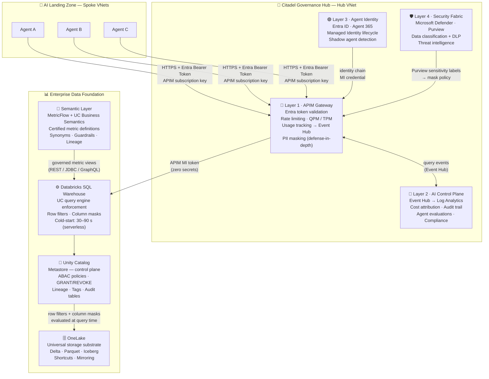

# Enterprise Data Foundation

Most enterprise AI deployments fail at the data layer. Agents produce plausible but ungoverned answers because they have no access to certified metric definitions. They bypass access controls because the data path was not designed for governed access. Usage is invisible because there is no telemetry for data queries. The Enterprise Data Foundation closes these three gaps — through architecture, not process.

This section documents how the AI Landing Zone, Citadel Governance Hub, and Enterprise Data Foundation combine into a complete, production-ready AI factory where every agent query is authenticated, rate-limited, usage-tracked, and governed at the data layer.

<Note>
The Data Foundation is **not** a fifth Citadel layer. It attaches to the existing four-layer model at three existing points: Layer 1 (APIM governs semantic endpoint access), Layer 2 (observability tracks data query patterns), and Layer 4 (Security Fabric enforces identity and column mask propagation). No new layer is created.
</Note>

---

## The Complete Stack



---

## How the Pieces Bind Together

The stack operates as a single governed pipeline. Each component owns a distinct responsibility; the components are not redundant.

| Component | Role | Governance Responsibility |
|-----------|------|--------------------------|
| **AI Landing Zone** | Isolated spoke VNets for agent workloads | Network boundary — agents cannot reach data endpoints directly |
| **APIM Gateway (Layer 1)** | Runtime enforcement plane | Validates Entra identity, enforces QPM rate limits, emits usage events, applies PII masking as defense-in-depth |
| **AI Control Plane (Layer 2)** | Observability and cost attribution | Ingests usage events from Event Hub → Log Analytics; provides cost attribution per agent/team; surfaces compliance signals |
| **Agent Identity (Layer 3)** | Identity lifecycle and zero-secrets chain | Issues and manages Entra Managed Identities for agents; feeds the identity chain that APIM validates |
| **Security Fabric (Layer 4)** | Threat intelligence and data governance foundation | Microsoft Purview classifies sensitive columns; Defender monitors the data path; Entra manages the full identity chain |
| **Semantic Layer** | Governed business intelligence substrate | Certified metric definitions (MetricFlow + UC Business Semantics) ensure every agent queries the same governed definition as BI dashboards |
| **Databricks SQL Warehouse** | Query engine and Unity Catalog enforcement point | Executes queries through UC — row filters and column masks are evaluated here, at query time, structurally |
| **Unity Catalog** | Governance control plane for data | Stores all governance metadata (GRANT, row filters, column masks, tags, lineage) independent of compute lifecycle |
| **OneLake** | Universal storage substrate | Provides a single ADLS-compatible namespace for all data sources; shortcuts and mirroring eliminate data movement |

---

## The Governed Data Query Path

Every agent data query traverses the full stack. The ASCII flow below traces a single semantic query from agent request to governed response:

```
╔══════════════════════════════════════════════════════════════════════════════╗
║              ENTERPRISE AI FACTORY — GOVERNED DATA QUERY PATH               ║
╠══════════════════════════════════════════════════════════════════════════════╣
║                                                                              ║
║  🤖 AI AGENT (Spoke VNet)                                                   ║
║     Entra Managed Identity (user-assigned)                                  ║
║     "What is ARR by region for Q1?"                                         ║
║       │                                                                      ║
║       │  HTTPS + Entra Bearer Token + APIM subscription key                 ║
║       ▼                                                                      ║
║  ┌────────────────────────────────────────────────────────────────────────┐ ║
║  │  🔷 LAYER 1 — APIM GATEWAY (Hub VNet, private endpoint)               │ ║
║  │                                                                        │ ║
║  │  [inbound]  validate-azure-ad-token  → check audience, issuer, expiry  │ ║
║  │  [inbound]  rate-limit-by-key        → QPM quota per subscription      │ ║
║  │  [inbound]  frag-semantic-usage      → emit query event → Event Hub    │ ║
║  │  [backend]  authentication-MI        → APIM exchanges its MI token     │ ║
║  │                                        (no PAT, no Key Vault secret)   │ ║
║  │  [outbound] frag-pii-masking         → regex catch residual PII        │ ║
║  └──────────────────────────────┬─────────────────────────────────────────┘ ║
║        │ (Event Hub)            │ (HTTPS, private endpoint, MI token)       ║
║        ▼                        ▼                                            ║
║  🔶 Layer 2               ⚙️ DATABRICKS SQL WAREHOUSE                       ║
║  Control Plane               MetricFlow / UC Business Semantics             ║
║  Cost attribution            "ARR Run-Rate" resolves to certified           ║
║  Audit trail                  formula: SUM(mrr) * 12 / active_count         ║
║  Compliance signals               │                                          ║
║                              ▼                                               ║
║                          🔐 UNITY CATALOG (metastore)                       ║
║                          Row filter: region = current_user_region()         ║
║                          Column mask: email → ***@domain.com                ║
║                          Lineage captured → permanent audit trail           ║
║                               │                                              ║
║                               ▼                                              ║
║                          🗄️ ONELAKE (unified storage)                       ║
║                          abfss://workspace@onelake.dfs...                   ║
║                          Delta tables — no data movement                    ║
║                          Entra ID auth on every storage request             ║
║                               │                                              ║
║                       (governed result set)                                  ║
║                               │                                              ║
║                       back through APIM → Agent                             ║
║                                                                              ║
║  Agent receives: governed metric result, masked PII, per-identity filtered  ║
║  Citadel records: who queried, what, when, how many times, what it cost     ║
╚══════════════════════════════════════════════════════════════════════════════╝
```

---

## Three Structural Guarantees

The architecture delivers three guarantees that cannot be achieved through process controls alone.

### 1. Governed Identity at Every Hop

```
Agent (Entra MI) → APIM (validates MI token) → Databricks (APIM MI token, no secret)
                                                    → Unity Catalog (evaluates caller identity)
                                                        → OneLake (Entra ID, no SAS token)
```

No secrets in the data path. No PATs, no connection strings, no shared keys. Every hop is an Entra identity validated at the next layer. Key Vault contains no data-access credentials.

### 2. Governance-by-Construction, Not by Convention

Unity Catalog column masks and row filters are SQL UDFs attached to table definitions. They execute inside the query engine — masked data is never materialized. A column mask is not a filter applied after the fact; it is part of the table definition evaluated every time the table is queried, by any engine, regardless of who is calling.

```
SELECT * FROM customers
  ├─ customer_id: 12345          ← returned as-is
  ├─ full_name: "Alice Smith"    ← returned as-is
  ├─ email: "***@example.com"    ← mask evaluated AT query time
  └─ ssn: "XXX-XX-6789"          ← mask evaluated AT query time

Unmasked values never leave the query engine.
```

APIM PII masking is defense-in-depth — it catches residual PII but is not the primary enforcement mechanism.

### 3. Full Observability: Agents and Data in One Audit Log

LLM usage (token counts, model calls) and data usage (SQL query counts, warehouse hits) flow through the same Event Hub → Log Analytics pipeline. Cost attribution, compliance reports, and audit queries cover the complete picture — not just the AI model traffic.

| Signal | Source | Destination |
|--------|--------|-------------|
| LLM token usage | `frag-llm-usage.xml` | Event Hub → Log Analytics |
| Semantic query count | `frag-semantic-usage.xml` | Event Hub → Log Analytics |
| Data access audit | Unity Catalog lineage system tables | Metastore (indefinite retention) |
| Agent identity | Layer 3 — Entra / Agent 365 | Entra audit logs |
| Threat signals | Layer 4 — Defender | Microsoft Sentinel |

---

## The Author-Once Principle Across the Stack

The semantic layer is the mechanism that ensures every AI agent — and every BI dashboard and Jupyter notebook — answers the same business question the same way.

```
Finance Analyst defines once:
  Unity Catalog Business Semantics
  ┌───────────────────────────────────────────────┐
  │  Metric: ARR Run-Rate                         │
  │  Formula: SUM(mrr) * 12 / active_count        │
  │  Dimensions: Region, Segment, Fiscal Period   │
  │  Row filter: region = current_user_region()   │
  │  Synonyms: "ARR", "annual recurring revenue"  │
  └──────────────┬────────────────────────────────┘
                 │  Open APIs: REST · JDBC · GraphQL
      ┌──────────┼──────────────────┐
      ▼          ▼                  ▼
  Power BI   Jupyter            AI Agent
  Dashboard  Notebook           (Genie /
                                conversational)

  Identical output · Identical governance · Single lineage source
```

Text-to-SQL agents infer this formula from column names — and produce results that are plausible, inconsistent, and unauditable. Platform-native semantic agents read the certified definition. The governance guarantee is architectural.

---

## What This Section Covers

<CardGroup cols={2}>
  <Card title="OneLake Architecture" icon="hard-drive" href="/data-foundation/onelake-architecture">
    Universal storage substrate — shortcuts vs mirroring, the universal namespace, and how security is enforced uniformly across Spark, SQL, KQL, and Analysis Services.
  </Card>
  <Card title="Unity Catalog Governance" icon="table" href="/data-foundation/unity-catalog-governance">
    Compute/governance separation, ABAC design for scale, the three-level namespace as a governance contract, and the Iceberg REST + OneLake integration path.
  </Card>
  <Card title="Semantic Layer" icon="cubes" href="/data-foundation/semantic-layer">
    Why platform-native semantics are required for enterprise AI — MetricFlow + UC Business Semantics, the author-once principle, and the Core vs Edge governance model.
  </Card>
  <Card title="APIM Governed Data Access" icon="link" href="/data-foundation/apim-semantic-endpoint">
    The governed semantic endpoint pattern — Entra token validation, QPM rate limiting, query-count usage tracking, and why a dedicated data access policy fragment is architecturally required.
  </Card>
  <Card title="Security & Identity Patterns" icon="fingerprint" href="/data-foundation/security-identity-patterns">
    Zero-secrets Managed Identity chain (agent → APIM → Databricks → OneLake) and governance-by-construction with Unity Catalog column masks.
  </Card>
</CardGroup>

---

<CardGroup cols={2}>
  <Card title="Layer 1: Governance Hub" icon="building-columns" href="/architecture/layer-1-governance-hub">
    The APIM capabilities this stack builds on — access contracts, policy fragments, product subscriptions, and Event Hub usage pipeline.
  </Card>
  <Card title="Layer 4: Security Fabric" icon="shield" href="/architecture/layer-4-security-fabric">
    Defender, Purview, and Entra — the unified protection layer that provides the identity and governance foundation for the data path.
  </Card>
</CardGroup>
